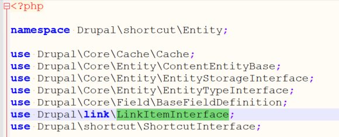
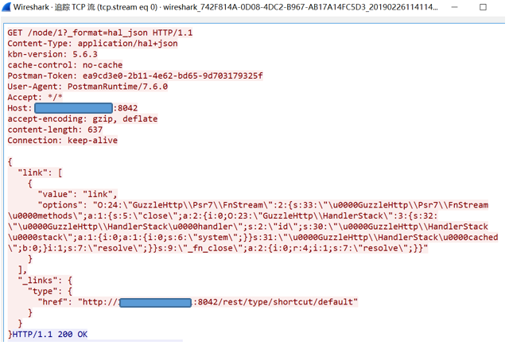
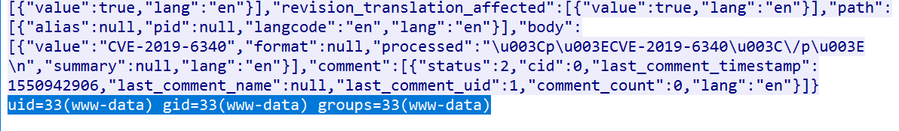
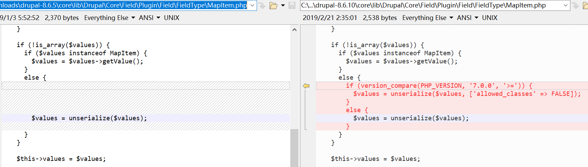

## Drupal远程代码执行漏洞

**漏洞名称：**Drupal远程代码执行漏洞

**漏洞描述**

Drupal是使用PHP语言编写的开源内容管理框架（CMF），它由内容管理系统（CMS）和PHP开发框架（Framework）共同构成。连续多年荣获全球最佳CMS大奖，是基于PHP语言最著名的WEB应用程序。著名用户包括：联合国、美国白宫、美国商务部、纽约时报、华纳、迪斯尼、联邦快递、索尼、美国哈佛大学、Ubuntu等。

从github上数据来看，Drupal使用广泛：

 

**漏洞分析**

Drupal在实现上，未对用户提交的数据进行严格过滤，在特定条件下，存在反序列化漏洞。攻击者成功利用，可直接在 Web 服务器上执行任意 PHP 代码和系统命令，造成服务器被入侵、用户信息泄露等后果。

根据实现，程序在进行REST API操作的过程中，options参数的内容可进入unserialize函数进行处理。如果用户提交的$values 为一个数组，且 $values['options'] 存在，那么就执行反序列化操作。此时只需要传入特定序列化后的命令，即可执行。

具体序列化可采用PHPGGC进行，如序列化“id”命令：

./phpggc guzzle/rce1 system id –json

同时需通过href参数调用LinkItem或者MapItem。走读源码发现Shortcut模块调用了LinkItemInterface，我们在href中对其进行访问：

"href": "http://192.168.1.25/drupal-8.6.9/rest/type/shortcut/default"

由于传入的是json格式，所以需要在头部指定“Content-Type: application/hal+json”，服务器为了解析json串，也需要安装对应插件。

具体请求如下所示：

id命令成功执行后，会返回执行结果：

**补丁展示**

官方在8.6.10版本中进行了修补，通过对比前后版本可知，问题出在反序列化处理上“$values = unserialize($values);”。

具体来说LinkItem.php和MapItem.php页面受到影响：

**影响范围**

Drupal v8.6系列 < 8.6.10；

Drupal v8.5系列 < 8.5.11；

Drupal v8.5之前的版本。

**官方解决方案**

升级至Drupal更新版本，该漏洞需升级至8.6.10或者8.5.11及以上版本。

**防护建议**

Web应用防火墙和应用安全网关用户的Web攻击防护规则中已发布相应规则，用于防护该Drupal 0day漏洞，开启相应策略即可防御针对该漏洞的攻击。