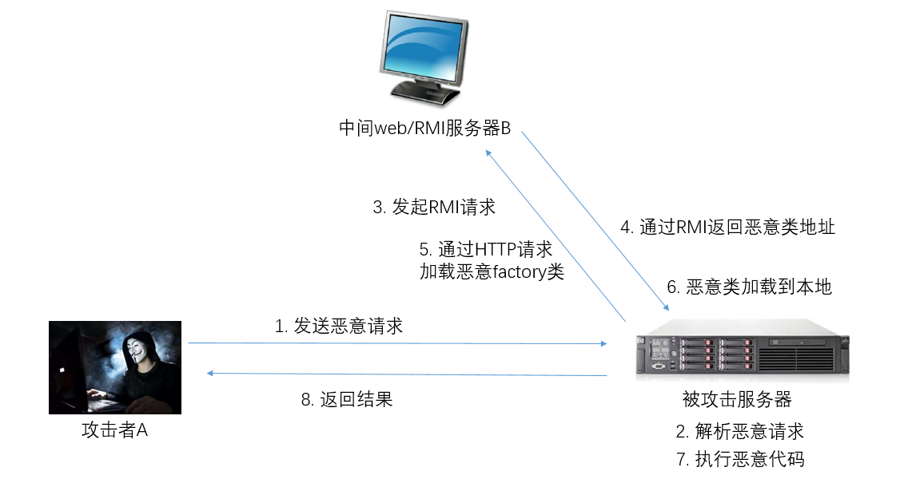
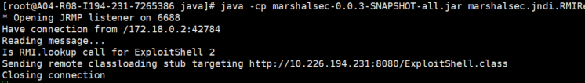
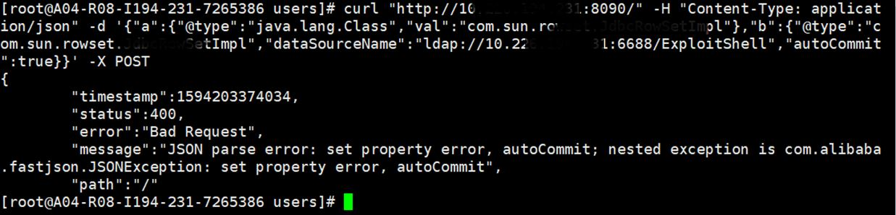
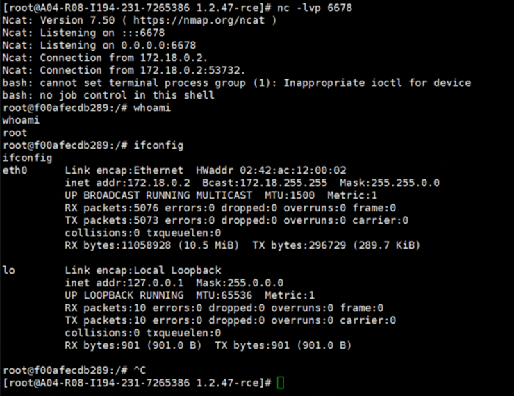
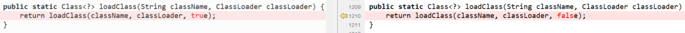

## FastJSON反序列化漏洞

**漏洞名称：**FastJSON反序列化漏洞

**漏洞描述**

FastJSON 1.2.47及以下版本在实现上存在一个反序列化漏洞，成功利用可远程执行恶意代码。在受影响版本中，攻击者可通过双json组合绕过FastJSON的黑名单策略补丁。

**攻击流程**

具体攻击流程如下图所示：

**攻击示例**

​    以下示例中成功反弹shell。

**1.**  配置中间web服务器，并将恶意类放置到web目录下；

**2.**  配置中间RMI服务器；

**3.**  开启NC监听；

**4.**  将恶意请求发送给被攻击服务器；

**5.**  成功反弹shell

**补丁展示**

对比1.2.47和1.2.48版本，可以明显的看到该漏洞的修复方法。

**影响范围**

FastJSON 1.2.24及以下版本

FastJSON 1.2.41至1.2.47版本

**官方解决方案**

升级至FastJSON最新版本，该漏洞需升级至1.2.48及以上版本。

**防护建议**

Web应用防火墙和应用安全网关用户的Web攻击防护规则中已发布相应规则，用于防护该FastJSON 0day漏洞，开启相应策略即可防御针对该漏洞的攻击。