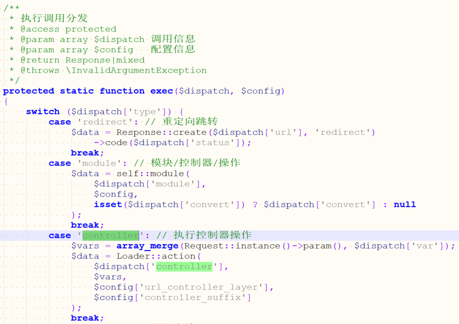
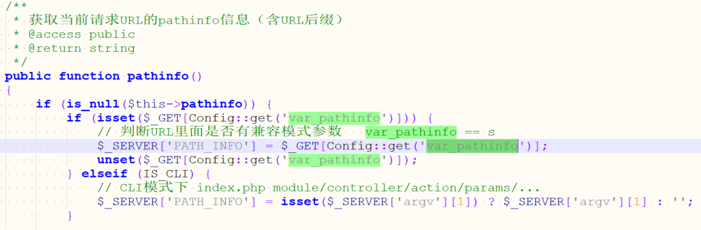
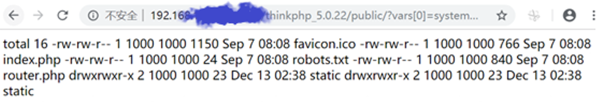
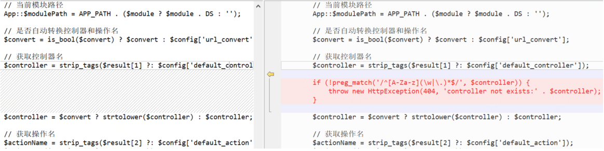

## ThinkPHP远程命令执行漏洞

**漏洞名称：**ThinkPHP远程命令执行漏洞

**漏洞描述**

ThinkPHP是一个快速、兼容而且简单的轻量级国产PHP开发框架，诞生于2006年初。该框架常被用来进行二次开发，国内应用非常广泛。

ThinkPHP在实现上，获取控制器名称时未对用户提交的参数进行严格过滤，在没有开启强制路由的情况下，攻击者可以通过输入’\’字符的方式调用任意方法，进行命令执行攻击。

**漏洞分析**

受影响程序在实现上未对控制器进行过滤，导致攻击者可以通过引入’\’符号来调用任意类方法。

其中通过parseModuleAndClass方法解析出$module和$class，然后实例化$class。当$name存在’\’时，通过strpos($name, '\\') 解析出方法和类。

根据程序实现，此处如果可以控制输入的$name，就可以实例化任何一个类。比如在5.0.x系列可以传入’ think\app’，5.1.x系列可以传入’ think\request’（ 5.0.x系列不可解析）。

通过parseUrlPath函数利用’/’分隔符可解析出“[模块/控制器/操作?]参数1=值1&参数2=值2”。parseUrlPath的输入$url参数从Request::path()中获得：

搜索源码可知，var_pathinfo对应固定参数名”s”。

根据以上分析结果，构造恶意url，并发送给测试服务器，可以成功读取ls信息：

 

**补丁展示**

官方在5.0.23版本中进行了修补，针对用户提交的内容，对经过“\”分隔得到controller名称通过正则表达式进行了非可见字符判断，当controller名称中包含特殊字符时，抛出异常：

**影响范围**

ThinkPHP v5.0系列 < 5.0.23

ThinkPHP v5.1系列 < 5.1.31

**官方解决方案**

升级至ThinkPHP最新版本，该漏洞需升级至5.0.23或5.1.31及以上版本。

**防护建议**

Web应用防火墙和应用安全网关用户的Web攻击防护规则中已发布相应规则，用于防护该ThinkPHP 0day漏洞，开启相应策略即可防御针对该漏洞的攻击。