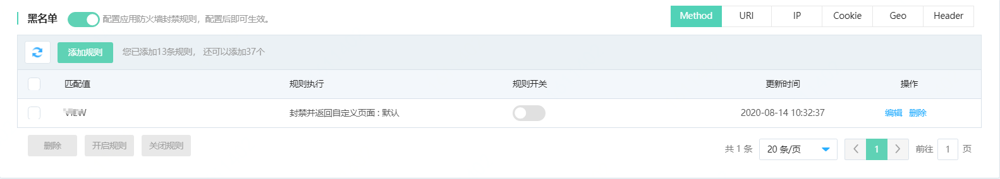
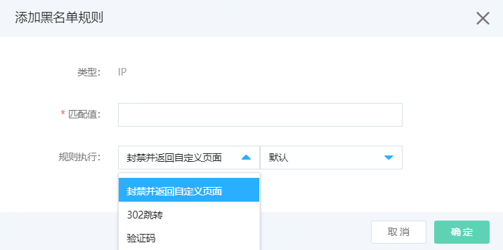
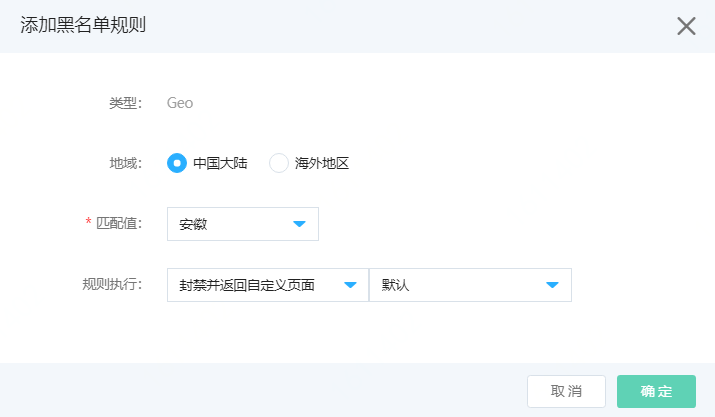
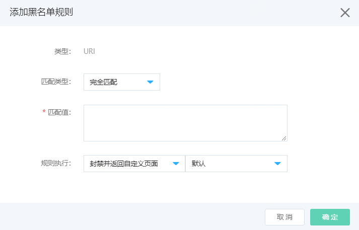
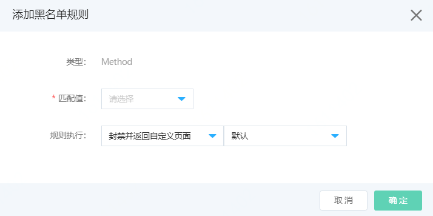
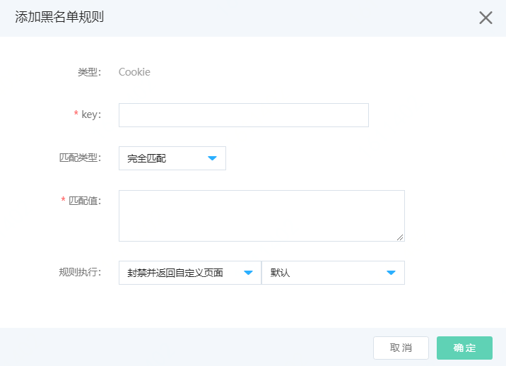
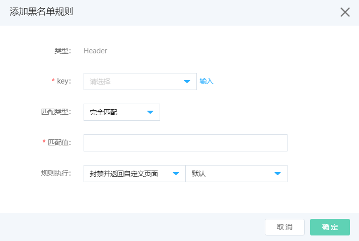
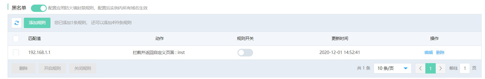
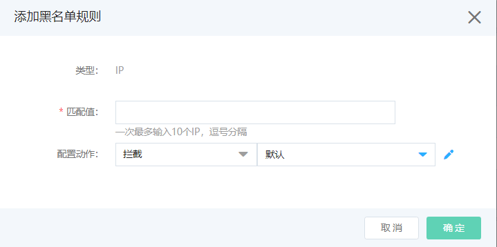

# 设置黑名单规则

网站接入Web应用防火墙后，您可以为其开启黑名单功能。黑名单支持域名级黑名单和实例级别黑名单。黑名单支持Method、URI、IP、Cookie、Geo（地理区域）、Header等维度添加黑名单。实例级黑名单支持实例范围内配置黑名单。您可以根据实际需求配置黑名单。

## 前提条件

- 已开通Web应用防火墙实例，更多信息，请参见[开通Web应用防火墙](https://docs.jdcloud.com/cn/web-application-firewall/purchase-process)。
- 已完成网站接入。更多信息，请参见[添加域名](https://docs.jdcloud.com/cn/web-application-firewall/step-1)。

## 域名黑名单

## 背景信息

黑名单支持Method、URI、IP、Cookie、Geo（地理区域）、Header等维度添加黑名单。

- IP黑名单帮助您阻断来自指定IP地址、IP地址段的访问请求。
- Geo黑名单帮助您阻断来自指定地理区域的IP地址的访问请求。支持指定中国内地各省份、海外地区。
- URI黑名单帮助您阻断访问指定URI的请求。
- Method黑名单帮助您阻断指定请求方法的访问请求。
- Cookie黑名单帮助您阻断携带指定Cookie信息的访问请求。

包年包月开通的Web应用防火墙实例，其黑名单功能有以下限制。

| 功能       | 说明                             | 高级版   | 企业版   | 旗舰版    |
| :--------- | :------------------------------- | :------- | :------- | :-------- |
| 黑名单规则 | 最多支持添加的黑名单规则的数量。 | 20（条） | 50（条） | 500（条） |

## 操作步骤

1. 登录[Web应用防火墙控制台](https://cloudwaf-console.jdcloud.com/overview/business)。

2. 在左侧导航栏，单击**网站配置**。

3. 在**网站配置**页面定位到要防护的域名，在操作栏单击**防护配置**。

4. 在防护配置页面，单击**访问控制**页签，定位到**黑名单**模块，开启**状态**开关，并点击**添加规则**。

   

5. 在**黑名单**页面，分别配置**Method黑名单**、**URI黑名单**、**IP黑名单**、**Cookie黑名单**、**Geo地域级IP黑名单**、**Header黑名单**。

   - **IP黑名单**：输入要封禁的IP地址，可以输入IPv4（8 16 24 32）和IPv6（64 128）地址及IP段。IP命中匹配值后的请求，可以选择执行：封禁、302跳转或验证码。配置完成后，单击页面下方的**确定**。

     

   - **Geo 黑名单**：地域可以选择**中国大陆**或**海外地区**：

     - 选择中国大陆时，可以选择地域匹配值，请求IP所属地区命中地域后，可以选择执行：封禁、302跳转或验证码。配置完成后，单击页面下方的**确定**。

     - 选择海外地区时，请求IP所属地区命中海外地域后，可以选择执行：**封禁**、**302跳转**或**验证码**。配置完成后，单击页面下方的**确定**。

       

   - **URI黑名单**：URI类型支持填写指定URI，匹配类型可以选择完全匹配、前缀匹配、正则匹配。当请求的目标URL命中匹配规则，选择执行：**封禁**、**302跳转**或**验证码**。配置完成后，单击页面下方的**确定**。
    
   
- **Method黑名单**：请求方法类型支持选择匹配值：GET、POST、HEAD、PUT、DELETE、PATCH、COPY、OPTIONS、LINK、UNLINK、PURGE、LOCK、UNOCK、PROPFIND、VIEW。请求Method命中方法后，可以选择执行：**封禁**、**302跳转**或**验证码**。配置完成后，单击页面下方的**确定**。
     	

   - **Cookie黑名单**：添加cookie类型黑名单，根据请求Cookie添加匹配规则：

     - key：Cookie的key，可编辑。

     - 匹配类型：可选完全匹配、前缀匹配或正则匹配

     - 匹配值：待匹配字符串
   
     - 规则执行：可选择**封禁**、**302跳转**或**验证码**。
   
       配置完成后，单击页面下方的**确定**。

     
   
   - **Header黑名单：**添加Header类型黑名单，根据请求Header的key添加匹配规则：
   
     - key：指Header的key，可选择，可编辑。
   
     - 匹配类型：可选完全匹配、前缀匹配或正则匹配。
   
     - 匹配值：待匹配字符串。
   
     - 规则执行：可选择**封禁**、**302跳转**或**验证码**。
   
       配置完成后，单击页面下方的**确定**。
     
     
   
   
  执行动作，如下表
  
  | 执行动作 | 配置                                            | 动作含义                                                     |
  | -------- | ----------------------------------------------- | ------------------------------------------------------------ |
  | 拦截     | 默认返回493页面，点击右侧笔，支持自定义拦截页面 | 对于命中规则的请求，将被拦截返回配置页面                     |
  | 302跳转  | 配置跳转的目标页面                              | 对于命中规则的请求，跳转到配置的目标页面                     |
  | 验证码   | 无需配置                                        | 对于命中规则的请求，弹出验证码二次校验，验证通过可以访问，不通过则拦截。 |
  
   成功添加黑名单规则后，规则默认不开启。您可以在规则列表中看到新建的规则，且其**防护状态**开关未开启。

## 实例黑名单

以上黑名单规则是基于域名配置的，在重大事件活动中，黑ip往往不止攻击一个域名，故WAF支持实例级别的黑名单。下面介绍一下实例黑名单的配置方法。

| 功能       | 说明                             | 高级版 | 企业版   | 旗舰版    |
| :--------- | :------------------------------- | :----- | :------- | :-------- |
| 黑名单规则 | 实例级别添加的黑名单规则的数量。 | 不支持 | 50（条） | 500（条） |

## 操作步骤

1. 登录[Web应用防火墙控制台](https://cloudwaf-console.jdcloud.com/overview/business)。

2. 在左侧导航栏，单击**实例配置**。

3. 在**实例管理**页面定位到要添加的实例，在操作栏单击**防护配置**。

4. 在防护配置页面，单击**访问控制**页签，定位到**黑名单**模块，开启**状态**开关，并点击**添加规则**。

   

5. 在**黑名单**页面，可以配置**IP黑名单**。输入要封禁的IP地址，可以输入IPv4（8 16 24 32）和IPv6（64 128）地址及IP段。IP命中匹配值后的请求，可以选择执行：封禁、302跳转或验证码。配置完成后，单击页面下方的**确定**。

   