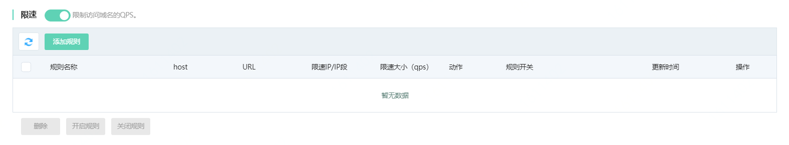
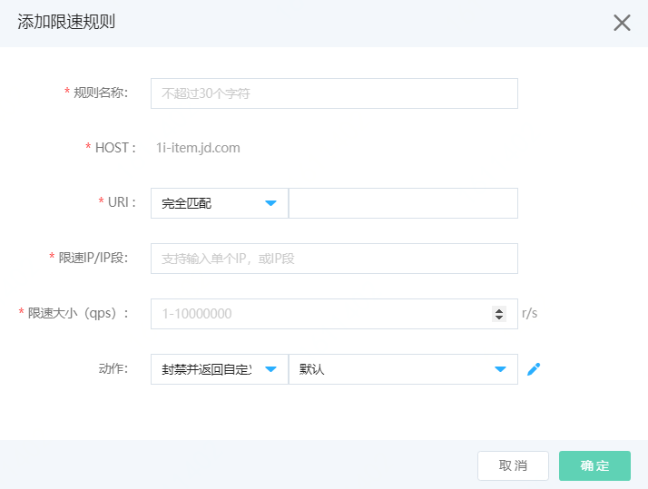

# 设置限速规则

网站接入Web应用防火墙后，您可以为其开启限速功能。限速可以限制指定IP（段）访问域名的QPS，帮助网站预防业务访问过载导致业务无法提供服务的情况。您可以根据实际需求设置限速规则。

## 前提条件

- 已开通Web应用防火墙实例，更多信息，请参见[开通Web应用防火墙](https://docs.jdcloud.com/cn/web-application-firewall/purchase-process)。
- 已完成网站接入。更多信息，请参见[添加域名](https://docs.jdcloud.com/cn/web-application-firewall/step-1)。

## 背景信息

限速功能是通过限制指定IP（段）访问域名的QPS，对于超过阈值的流量，支持配置返回493拦截页面或者302跳转到自定义页面来限制域名访问的峰值流量。限速可以在业务请求出现峰值时，缓解过多请求对源站服务器资源的消耗，将每个最小单位时间（ms级别）超过预设的限速值的请求拦截或者跳转到指定页面，从而达到对源站服务的保护，保证源站可以持续不断的提供服务。

## 使用限制

包年包月开通的Web应用防火墙实例，其限速功能有以下限制。

| 功能     | 说明                           | 高级版   | 企业版   | 旗舰版   |
| :------- | :----------------------------- | :------- | :------- | :------- |
| 限速规则 | 最多支持添加的限速规则的数量。 | 10（条） | 20（条） | 20（条） |

## 操作步骤

1. 登录[Web应用防火墙控制台](https://cloudwaf-console.jdcloud.com/overview/business)。

2. 在左侧导航栏，单击**网站配置**。

3. 在**网站配置**页面定位到要防护的域名，在操作栏单击**防护配置**。

4. 在防护配置页面，单击**访问控制**页签，定位到**限速**模块，开启**状态**开关，并点击**添加规则**。

   

5. 添加限速规则。在添加规则对话框，完成以下规则配置。

   

   | 配置项              | 说明                                                         |
   | :------------------ | :----------------------------------------------------------- |
   | **规则名称**        | 为规则命名。                                                 |
   | **HOST**            | 当前HOST                                                     |
   | **URI**             | 指定限制的URI，即只在指定的页面设置限速信息。 填写：匹配方式+路径 匹配方式可选：**完全匹配**、**前缀匹配**和**包含匹配**。 |
   | **限速IP/IP段**     | 支持输入单个IP地址、IP地址段或全部IP段。 **IP**：输入需要限制的IPv4和IPv6地址，例如 192.168.1.1 **IP段**：输入需要限制的IP段，支持IPv4（8 16 24 32）和IPv6（64 128），例如10.10.10.0/24 **全部IP段**：输入0.0.0.0/0 |
   | **限速大小（qps）** | 输入qps（query per second），支持输入1-10000000范围。        |
   | **Busrt**           | Burst：突发流量参数，配合限速大小以便有更好的效果。默认为0，可以设置0-500，一般设置为限速大小的1/10。 |
   | **匹配动作**        | 请求流量的IP（段），达到配置限速的QPS，则执行匹配动作： **302跳转**：跳转到配置的目标页面 **拦截**：拦截请求反馈默认493页面，支持返回自定义页面（需先上传自定义页面）。 |

## 后续步骤

开启限速规则后，您可以在**全量日志**页面查看**日志查询** 页签搜索**限速**类型报表，查询触发限速规则被过滤或拦截的访问请求的日志。更多信息，请参见**查看安全报表**。