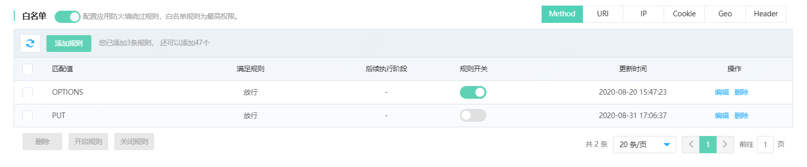
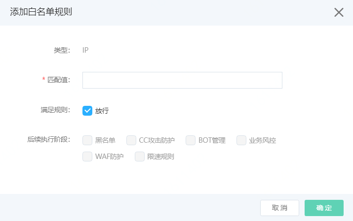
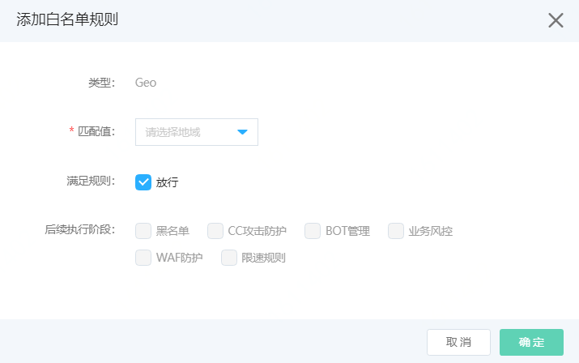
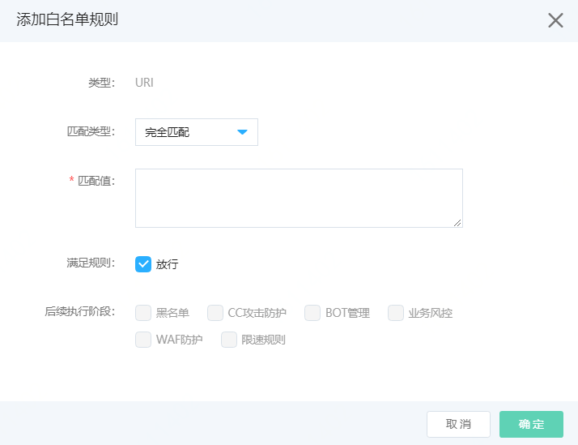
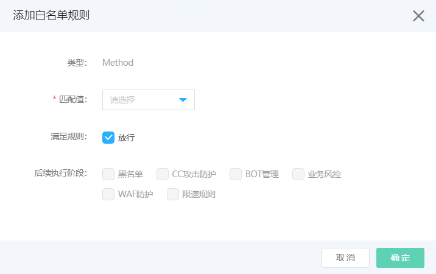
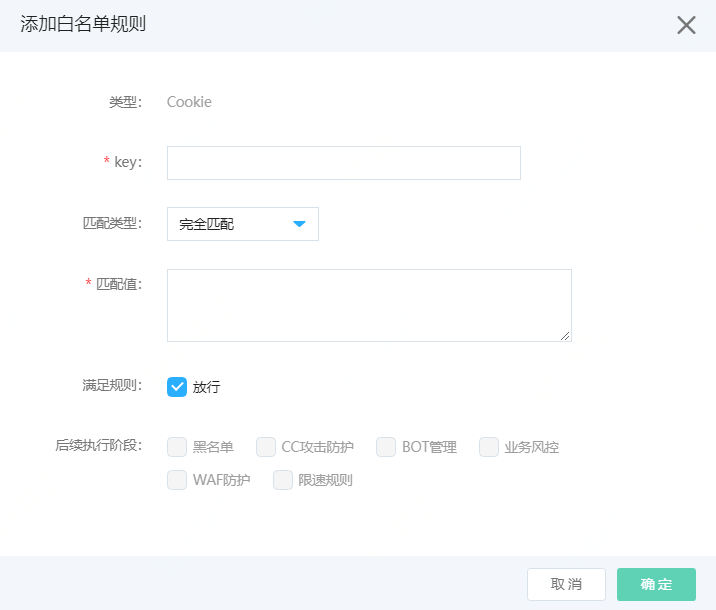
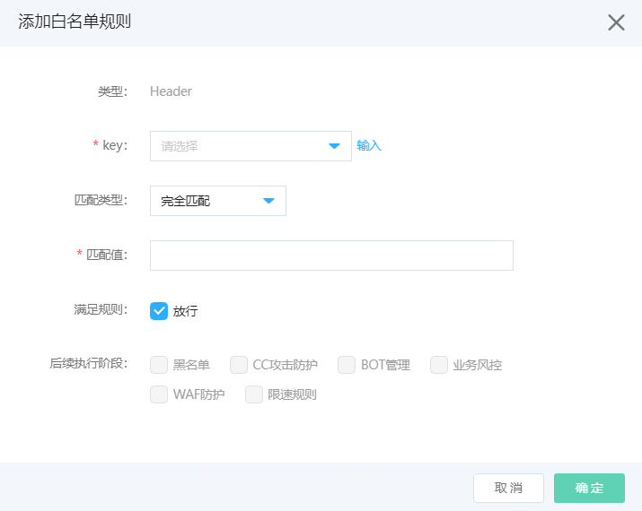
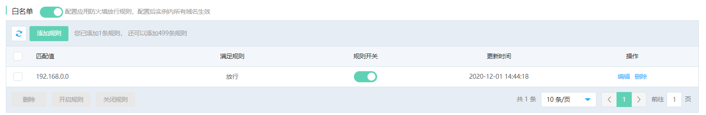
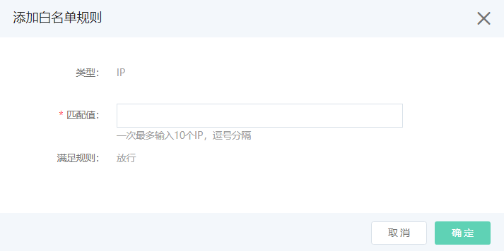

# 设置白名单规则

网站接入Web应用防火墙后，所有请求流量将依次经过WAF后返回源站，保证网站安全性。您可以设置白名单，使满足条件的请求忽略指定的检测模块。白名单分为域名白名单和实例白名单，本文为您介绍配置规则。

## 前提条件

- 已开通Web应用防火墙实例，更多信息，请参见[开通Web应用防火墙](https://docs.jdcloud.com/cn/web-application-firewall/purchase-process)。
- 已完成网站接入。更多信息，请参见[添加域名](https://docs.jdcloud.com/cn/web-application-firewall/step-1)。

## 域名白名单

## 背景信息

白名单支持添加Method、URI、IP、Cookie、Geo（地理区域）、Header等维度的白名单。一般应用于放行因触发规则被误拦截的特殊业务请求，可以直接放行或者选择不检测对应的模块。

包年包月开通的Web应用防火墙实例，其白名单功能有以下限制。

| 功能       | 说明                             | 高级版   | 企业版   | 旗舰版   |
| :--------- | :------------------------------- | :------- | :------- | :------- |
| 白名单规则 | 最多支持添加的白名单规则的数量。 | 20（条） | 50（条） | 50（条） |

## 操作步骤

1. 登录[Web应用防火墙控制台](https://cloudwaf-console.jdcloud.com/overview/business)。

2. 在左侧导航栏，单击**网站配置**。

3. 在**网站配置**页面定位到要防护的域名，在操作栏单击**防护配置**。

4. 在防护配置页面，单击**访问控制**页签，定位到**白名单**模块，开启**状态**开关，并点击**添加规则**。

   

5. 在**白名单**页面，分别配置**Method白名单**、**URI白名单**、**IP白名单**、**Cookie白名单**、**Geo地域级IP白名单**、**Header白名单**。

   - **IP白名单**：输入要放行的IP地址，可以输入IPv4（8 16 24 32）和IPv6（64 128）地址及IP段。IP命中匹配值后的请求，可以选择直接放行，或者选择后续执行阶段。配置完成后，单击页面下方的**确定**。

     

   - **Geo 白名单**：地域可以选择**中国大陆**或**海外地区**：

     - 选择中国大陆时，可以选择地域匹配值，请求IP所属地区命中地域后，可以选择直接放行，或者选择后续执行阶段。配置完成后，单击页面下方的**确定**。
     - 选择海外地区时，请求IP所属地区命中海外地域后，可以选择直接放行，或者选择后续执行阶段。配置完成后，单击页面下方的**确定**。
     
     
          

- **URI白名单**：URI类型支持填写目标URI，匹配类型可以选择完全匹配、前缀匹配、正则匹配。可以选择直接放行，或者选择后续执行阶段。配置完成后，单击页面下方的**确定**。
  
  
  
- **Method白名单**：请求方法类型支持选择匹配值：GET、POST、HEAD、PUT、DELETE、PATCH、COPY、OPTIONS、LINK、UNLINK、PURGE、LOCK、UNOCK、PROPFIND、VIEW。请求Method命中方法后，可以选择直接放行，或者选择后续执行阶段。配置完成后，单击页面下方的**确定**。
  
  
  
- **Cookie白名单**：添加cookie类型白名单，根据请求Cookie添加匹配规则：
  
  - **key**：Cookie的key，可编辑。
  
  - **匹配类型**：可选完全匹配、前缀匹配或正则匹配
  
     - 匹配值：待匹配字符串
  
       请求的Cookie命中设置的规则后，可以选择直接放行，或者选择后续执行阶段。配置完成后，单击页面下方的**确定**。
  
  
  
   - **Header白名单**：添加Header类型白名单，根据请求Header的key添加匹配规则：
  
     - key：Header的key，可选择下拉框中的key或点击输入编辑。
  
     - 匹配类型：可选完全匹配、前缀匹配或正则匹配
  
     - 匹配值：待匹配字符串
  
       请求的Header命中设置的规则后，可以选择直接放行，或者选择后续执行阶段。配置完成后，单击页面下方的**确定**。
  
     
  
   **勾选放行规则**：
  
   - 如果请求满足规则，所有模块都不检测，勾选放行。
  
   - 如果请求满足规则，选择部分模块放行，部分模块检测，则不勾选放行，选择后续执行阶段。WAF中所有模块执行顺序：**白名单** -> **黑名单** -> **CC安全防护** -> **BOT管理** -> **业务风控** -> **Web防护** -> **限速**。
  
   成功添加白名单规则后，规则默认不开启。您可以在规则列表中看到新建的规则，且其**防护状态**开关未开启。

## 实例白名单

以上白名单规则是基于域名配置的，实际应用中，有些业务IP在所有域名下都需要加黑，这时可以使用实例级白名单。下面介绍一下实例白名单的配置方法。

| 功能       | 说明                             | 高级版 | 企业版   | 旗舰版    |
| :--------- | :------------------------------- | :----- | :------- | :-------- |
| 白名单规则 | 最多支持添加的白名单规则的数量。 | 不支持 | 50（条） | 500（条） |

## 操作步骤

1. 登录[Web应用防火墙控制台](https://cloudwaf-console.jdcloud.com/overview/business)。

2. 在左侧导航栏，单击**实例配置**。

3. 在**实例管理**页面定位到要添加的实例，在操作栏单击**防护配置**。

4. 在防护配置页面，单击**访问控制**页签，定位到**白名单**模块，开启**状态**开关，并点击**添加规则**。

   

5. 在**白名单**页面，可以配置**IP白名单**。输入要放行的IP地址，可以输入IPv4（8 16 24 32）和IPv6（64 128）地址及IP段。IP命中匹配值后的请求，可以选择直接放行，或者选择后续执行阶段。配置完成后，单击页面下方的**确定**。

   