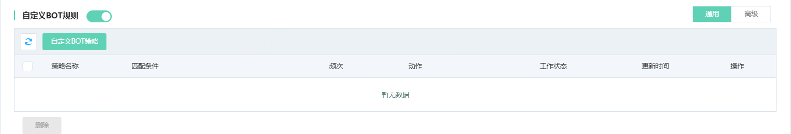
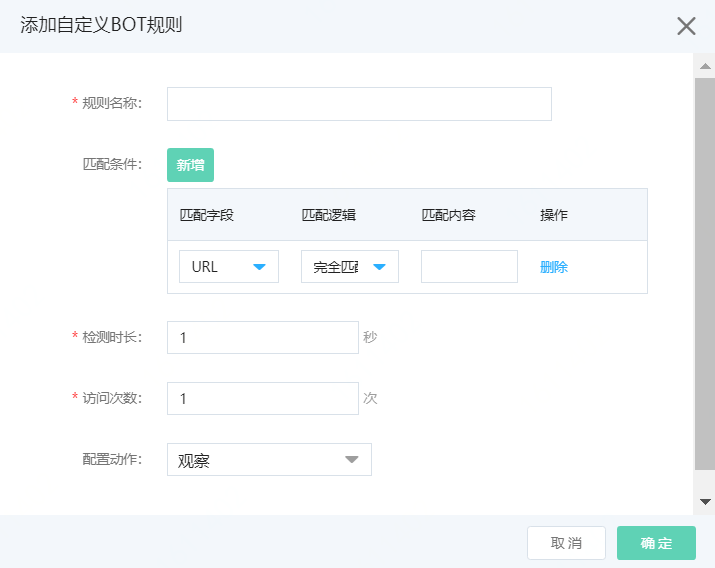
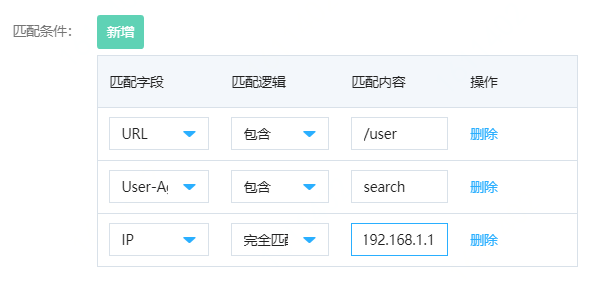
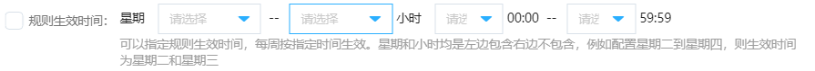

# 设置自定义BOT规则-通用

Web应用防火墙支持添加自定义规则对BOT机器人请求进行识别并配置动作（如拦截），通用的自定义规则主要是在指定的Host（域名）下针对IP请求的维度进行配置规则和识别统计，本页主要介绍自定义BOT规则的使用方式。

## 前提条件

- 已开通Web应用防火墙实例，企业版及以上的套餐版本，更多信息，请参见[开通Web应用防火墙](https://docs.jdcloud.com/cn/web-application-firewall/purchase-process)。
- 已完成网站接入。更多信息，请参见[添加域名](https://docs.jdcloud.com/cn/web-application-firewall/step-1)。

## 使用限制

包年包月开通的Web应用防火墙实例，其自定义BOT规则-通用功能有以下限制。

| 功能               | 说明                                     | 高级版 | 企业版   | 旗舰版 |
| :----------------- | :--------------------------------------- | :----- | :------- | :----- |
| 自定义BOT规则-通用 | 最多支持添加的自定义BOT规则-通用的数量。 | 不支持 | 20（条） | 不限   |

## 操作步骤

1. 登录[Web应用防火墙控制台](https://cloudwaf-console.jdcloud.com/overview/business)。

2. 在左侧导航栏，单击**网站配置**。

3. 在**网站配置**页面定位到要防护的域名，在操作栏单击**防护配置**。

4. 在防护配置页面，单击**BOT管理**页签，定位到**自定义BOT规则**模块，开启**状态**开关。选择**通用**页签。

   

​	5.点击**自定义BOT策略**按钮，按照下图配置信息。

| 配置项                   | 说明                                                         |
| :----------------------- | :----------------------------------------------------------- |
| **规则名称**             | 可以输入规则名称，不超过30个字符。                           |
| **URI**                  | 可以输入待防护的URI                                          |
| **统计维度**             | 可以选择IP、Cookie、Header、Args。                           |
| **匹配条件**             | 支持添加URL、User-Agent、IP、Cookie、Referer维度匹配条件。 每一个匹配条件支持**完全匹配**和**包含**匹配。 添加的条件之间是**与**的关系。每一条规则最多支持**5个**匹配条件  |
| **检测时长**             | 规则的检测时长，单元是秒。                                   |
| **访问次数**             | 在检测时长内，输入单一IP访问次数，配置频次。                 |
| **响应码**（可选）       | 为可选配置项。输入待统计的响应码，可以按照数量统计达到某个阈值，也可以按照比例统计，达到某个比例。 |
| **规则生效时间**（可选） | 为可选规则。可以选择星期和小时范围。勾选后，选择时间生效。  |
| **配置动作**             | 可以选择观察、人机交互、拦截动作。 **观察**：放行请求，只记录日志。 **人机交互**：对请求进行人机交互挑战，验证成功则放行；不成功则拦截。 **拦截**：拦截请求，返回493页面，支持返回自定义页面（需先上传自定义页面） |

点击**确定**，添加自定义Bot规则。