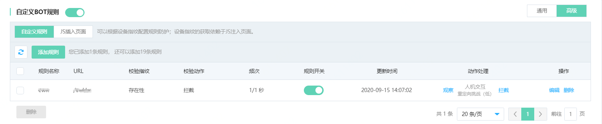
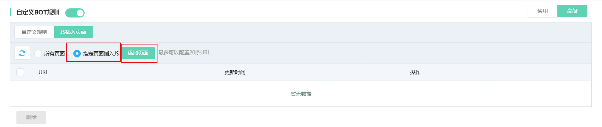
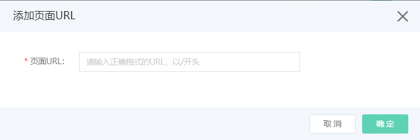
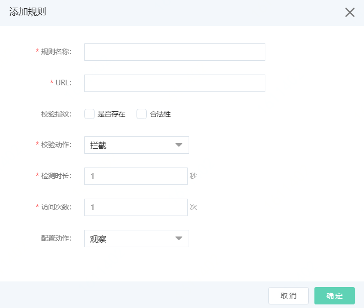

# 设置自定义BOT规则-高级

Web应用防火墙支持添加自定义规则对BOT机器人请求进行识别并配置动作（如拦截），自定义通用规则主要是在指定的Host（域名）下针对IP请求的维度进行配置规则和识别统计，高级自定义规则则是基于设备指纹维度进行规则配置。自定义高级规则主要是解决：如果爬虫经过IP池，会形成单IP爬取低频次的情况，这种情况通过通用的自定义规则和防爬虫模块无法识别。本页主要介绍**自定义BOT规则-高级**的使用方式。

## 前提条件

- 已开通Web应用防火墙实例，企业版及以上的套餐版本，更多信息，请参见[开通Web应用防火墙](https://docs.jdcloud.com/cn/web-application-firewall/purchase-process)。
- 已完成网站接入。更多信息，请参见[添加域名](https://docs.jdcloud.com/cn/web-application-firewall/step-1)。
- 只支持网页，通过浏览器访问并且可以执行JS程序。

## 背景信息

自定义BOT规则-高级工作原理是对疑似BOT请求执行JS，生成指纹信息（用于再次请求校验），子请求携带指纹信息，进行验证和标识。高级规则工作是基于指纹校验和基于指纹的频次统计。对于多IP慢速爬虫，有比较好的防护效果。生成指纹信息需要通过页面执行JS，所以需要先设置JS页面，然后自定义配置指纹校验和基于指纹频次的规则。

包年包月开通的Web应用防火墙实例，其自定义BOT规则-高级功能有以下限制。

| 功能               | 说明                                     | 高级版 | 企业版   | 旗舰版   |
| :----------------- | :--------------------------------------- | :----- | :------- | :------- |
| 自定义BOT规则-高级 | 最多支持添加的自定义BOT规则-高级的数量。 | 不支持 | 10（条） | 20（条） |

## 操作步骤

1. 登录[Web应用防火墙控制台](https://cloudwaf-console.jdcloud.com/overview/business)。

2. 在左侧导航栏，单击**网站配置**。

3. 在**网站配置**页面定位到要防护的域名，在操作栏单击**防护配置**。

4. 在防护配置页面，单击**BOT管理**页签，定位到**自定义BOT规则**模块，开启**状态**开关。点击右侧**高级**Tab页。

   

​	5.点击**JS插入页面**Tab，如下图，本页主要配置JS注入页面，用于设备指纹的获取。默认选择所有页面支持注入JS。

​	如果待防护页面不支持全部注入JS，可以选择指定页面插入JS。如下图

​	点击**添加页面**，添加指定插入JS页面。如图，输入完整的URL。

6.点击**自定义规则**Tab，点击**添加规则**，按照下图配置信息。

| 配置项       | 说明                                                         |
| :----------- | :----------------------------------------------------------- |
| **规则名称** | 可以输入规则名称，不超过30个字符。                           |
| **URL**      | 输入待防护的URL。                                            |
| **校验指纹** | 校验指纹维度包括**是否存在**和**合法性**： **是否存在**：请求是否携带了生成的指纹。 **合法性**：携带的指纹是否合法。 |
| **校验动作** | 校验指纹过程中，如遇不符合的请求，则可以选择人机识别和拦截动作。 **人机识别**：进行人机挑战，如果通过则可以正常访问，不通过则拦截。 **拦截**：返回493拦截页面，阻断请求 |
| **检测时长** | 规则的统计时长，单位是秒。                                   |
| **访问次数** | 在检测时长内，基于指纹的统计阈值。超过阈值则执行配置动作。   |
| **配置动作** | 可以选择观察、人机交互、拦截动作。 **观察**：放行请求，只记录日志。 **人机交互**：对请求进行人机交互挑战，验证成功则放行；不成功则拦截。 **拦截**：返回493拦截页面，支持返回自定义页面（需先上传自定义页面） |

点击**确定**，添加自定义Bot规则。