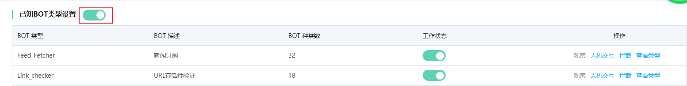
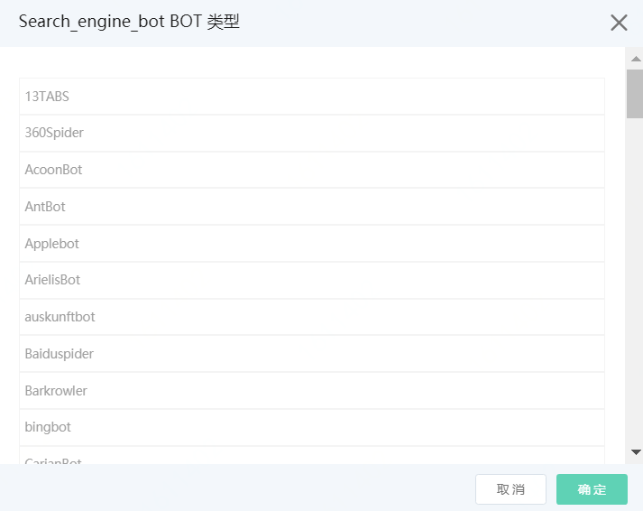
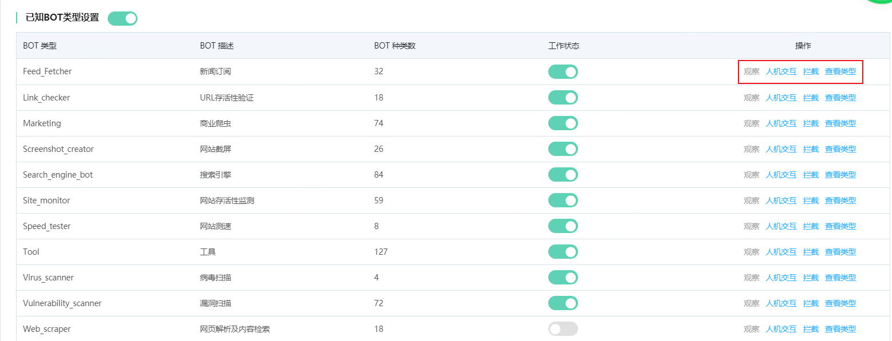

# 设置已知爬虫库规则

Web应用防火墙支持对BOT机器人程序进行甄别分类，并采取针对性的流量管理策略，例如，放行搜索引擎类机器人流量，对恶意爬取商品信息、秒杀价格、库存信息等核心数据进行阻断，还可以应对恶意机器人程序爬取带来的资源消耗、查询业务数据等问题，同时也保障友好机器人程序（如搜索引擎，广告程序）的正常运行。本页主要介绍BOT管理模块中已知爬虫库的使用方式。

## 前提条件

- 已开通Web应用防火墙实例，企业版及以上的套餐版本，更多信息，请参见[开通Web应用防火墙](https://docs.jdcloud.com/cn/web-application-firewall/purchase-process)。
- 已完成网站接入。更多信息，请参见[添加域名](https://docs.jdcloud.com/cn/web-application-firewall/step-1)。

## 背景信息

Web应用防火墙提供已知类型爬虫库，包括11个已知公开的 BOT 大类，超过300+的 BOT 子类，包括搜索引擎、测速工具、内容聚合、扫描和网页爬虫等类别。用户可以根据自身需求对公开 BOT 类别设置防护动作（观察、人机交互、拦截），WAF 将对命中公开类型的 BOT 请求进行相应处理。

**说明** 在Bot管理模块外，您还可以使用访问控制规则进一步加白友好爬虫白名单IP或UA的请求。

## 操作步骤

1. 登录[Web应用防火墙控制台](https://cloudwaf-console.jdcloud.com/overview/business)。

2. 在左侧导航栏，单击**网站配置**。

3. 在**网站配置**页面定位到要防护的域名，在操作栏单击**防护配置**。

4. 在防护配置页面，单击**BOT管理**页签，定位到**已知BOT类型设置**模块，开启**状态**开关。

   

​	5.在**已知BOT类型**规则列表，根据**BOT描述**选择是否开启对应的启用状态。可点击**查看类型**，查看BOT类型详情。对要放行的合法爬虫，在操作栏下开启**观察**开关。所有BOT规则默认开启**观察**模式。建议您放行来自搜索引擎的爬虫请求（Google、Bing、百度、搜狗、360），即选择**观察**模式。

| 操作     | 说明                                                 |
| :------- | :--------------------------------------------------- |
| 观察     | 放行请求，只记录日志                                 |
| 人机交互 | 对请求进行人机交互挑战，验证成功则放行；不成功则拦截 |
| 拦截     | 拦截请求，返回493页面                                |

