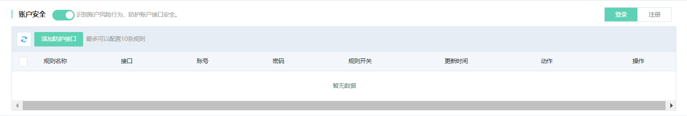
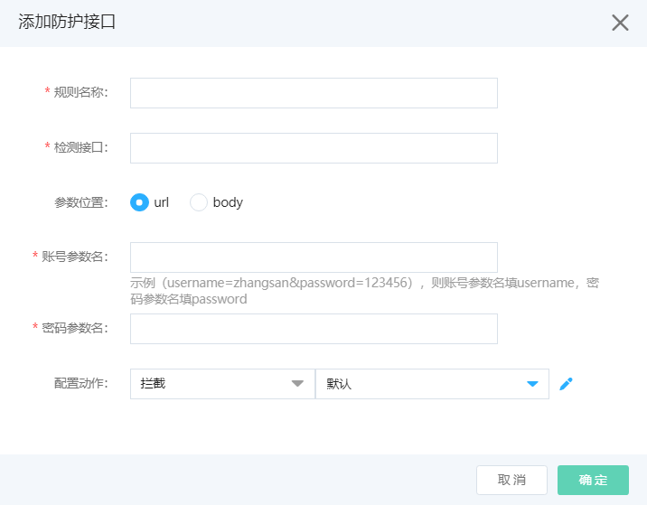

# 账号安全

网站接入Web应用防火墙后，您可以为其开启账号安全功能。账号安全帮助您防御与账号相关的安全风险事件（例如注册、登录），具体包括撞库、暴力破解、垃圾注册、短信验证码接口滥刷。使用账户安全检测时，您只在WAF中配置防护接口，即可对接口做防护。

## 前提条件

- 已开通Web应用防火墙实例，企业版及以上的套餐版本，更多信息，请参见[开通Web应用防火墙](https://docs.jdcloud.com/cn/web-application-firewall/purchase-process)。
- 已完成网站接入。更多信息，请参见[添加域名](https://docs.jdcloud.com/cn/web-application-firewall/step-1)。

## 背景信息

包年包月开通的Web应用防火墙实例，其账号安全功能有以下限制。

| 功能     | 说明                         | 高级版 | 企业版  | 旗舰版   |
| :------- | :--------------------------- | :----- | :------ | :------- |
| 账号安全 | 最多支持添加的防护接口数量。 | 不支持 | 3（条） | 10（条） |

## 操作步骤

1. 登录[Web应用防火墙控制台](https://cloudwaf-console.jdcloud.com/overview/business)。

2. 在左侧导航栏，单击**网站配置**。

3. 在**网站配置**页面定位到要防护的域名，在操作栏单击**防护配置**。

4. 在防护配置页面，单击**业务风控**页签，定位到**账号安全**模块，开启**状态**开关。

   

5. 在防护请求Tab页，点击**添加防护接口**，按照下表填写防护请求。

   

   | 配置项         | 配置项说明                                                   |
| :------------- | :----------------------------------------------------------- |
   | **规则名称**   | 输入防护规则的名称                                           |
| **检测接口**   | 输入账号信息提交接口的URI，检测接口不是登录接口所在页面的地址（/login）,是填写调用登录/注册接口的接口信息。 |
   | **参数位置**   | 参数位置，可以选择是在url中或者body中。                      |
   | **账号参数名** | 填写账号字段对应的参考名称。                                 |
   | **密码参数名** | 填写密码字段对应的参数名称。                                 |
   | **配置动作**   | 账号安全的防护模式。可选值： **观察**：识别到业务攻击时，只记录风险日志、不进行拦截，可通过业务风控日志查看详细风险情况。 **人机交互**：识别到业务攻击时，进行算法挑战进行二次验证。 **拦截**：发现异常请求后，直接阻断。可配置自定义返回页面。 |

6.点击**确定**，添加规则。防护请求添加成功后，10分钟左右生效。

7.账户安全接口配置示例：

- 假设用户登录接口是`/login.do`，提交的POST请求body中内容样例为`username=Jammy&pwd=618618`，则**账号参数名**是`username`，**密码参数名**是`password`，可以按截图所示进行配置。
- 如果登录账号参数位于GET请求的URL中，例如`/login.do?username=zhangsan&password=618618`，则只需将**请求方式**设置为**GET**，其余设置与截图一致。

成功添加检测接口后，WAF后台会下发检测任务。若被检测接口的流量命中检测逻辑，一般几个小时后就开始产出账户安全风险事件。

