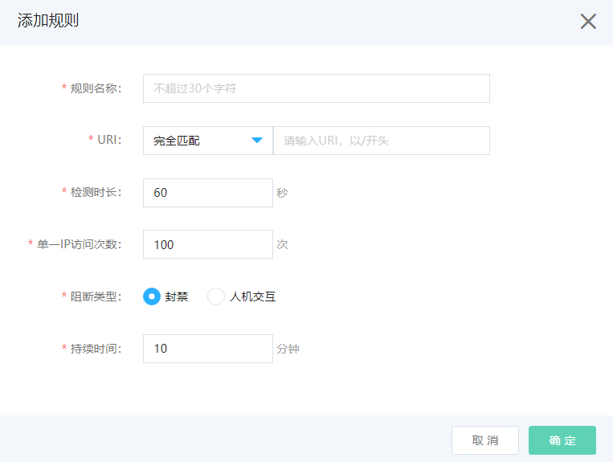

# 设置CC安全防护

网站接入Web应用防火墙后，CC安全防护功能默认开启，拦截对网站的CC攻击。您可以根据实际需求调整CC安全防护的防护模式。

## 前提条件

- 已开通Web应用防火墙实例。更多信息，请参见[开通Web应用防火墙](https://docs.jdcloud.com/cn/web-application-firewall/purchase-process)。
- 已完成网站接入。更多信息，请参见[添加网站](https://docs.jdcloud.com/cn/web-application-firewall/step-1)。

## 使用限制

包年包月开通的Web应用防火墙实例，其CC自定义防护功能有以下限制。

| 规格         | 说明                             | 高级版 | 企业版   | 旗舰版   |
| :----------- | :------------------------------- | :----- | :------- | :------- |
| CC自定义规则 | 最多支持添加的自定义规则的数量。 | 不支持 | 20（条） | 50（条） |

## 操作步骤

1、登录[Web应用防火墙控制台](https://cloudwaf-console.jdcloud.com/overview/business)。

2、在左侧导航栏，单击**网站配置**。

3、在**网站配置**页面定位到要设置的域名，在操作栏单击**防护配置**。

4、在防护配置页面，默认打开**Web防护**页签，确保**总体防护开关**是开启状态。切换到**CC安全防护**页签。

5、设置**CC安全防护**模式。

| 配置项       | 说明                                                         |
| :----------- | :----------------------------------------------------------- |
| **状态**     | 开启或关闭CC安全防护功能。                                   |
| **防护模式** | 要应用的防护模式。可选值： **正常**：默认使用正常模式。建议您在网站无明显流量异常时应用此模式。正常模式基于host、IP、URL等维度指标统计。 **全局模式**：基于全局host访问量可以设置，单IP访问量保持不变。 **单IP模式**：基于单IP访问量可以设置，全局host保持不变。 **防护-紧急**：当您发现有防护模式无法拦截的CC攻击，并出现网站响应缓慢，流量、CPU、内存等指标异常时，可以应用此模式。将对所有请求返回验证码验证，请慎用。 **说明** 防护-紧急模式适用于网页/H5页面，但不适用于API/Native App业务 |
| **配置动作** | 请求达到CC模式阈值后，执行的动作： **观察**：放行请求，只记录日志。 **动态防护(默认)**：根据请求的情况，动态进行防护。当请求量超过阈值时，随着请求量的增多，依次进行JS校验，人机交互（验证码）校验，最后拦截。 **人机交互(验证码)**:对请求进行人机交互挑战，验证成功则放行；不成功则拦截。 **302跳转**:把请求重定向到指定页面。 **拦截**：拦截请求，返回493页面，支持返回自定义页面（需先上传自定义页面）  |

| 配置项             | 说明                                                         |
| ------------------ | ------------------------------------------------------------ |
| **规则名称**       | 可以输入规则名称，不超过30个字符。                           |
| **URI**            | 指定待防护的URI： 填写：匹配方式+路径 匹配方式可选：**完全匹配**、**前缀匹配**、**包含匹配**和**后缀匹配**。 |
| **统计维度**       | 可选 IP、Session维度。                                       |
| **检测时长**       | 规则的检测时长，单位是秒。                                   |
| **单一IP访问次数** | 在检测时长内，输入单一IP访问次数。建议按照业务正常流量的3-10倍进行配置。 |
| **配置动作**       | 同时命中匹配URI，检测时长内单IP达到访问次数，则执行的配置动作： **人机交互**：人机算法挑战 **拦截**：拦截请求反馈默认493页面，支持返回自定义页面（需先上传自定义页面）。 |
| **持续时间**       | 命中规则后，执行配置动作的持续时间。单位为分钟。             |

