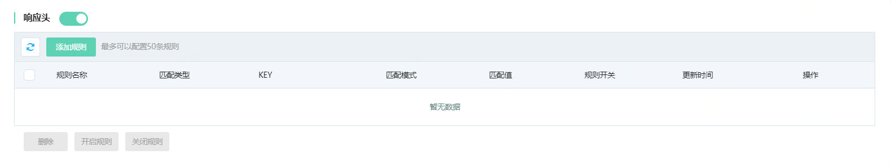
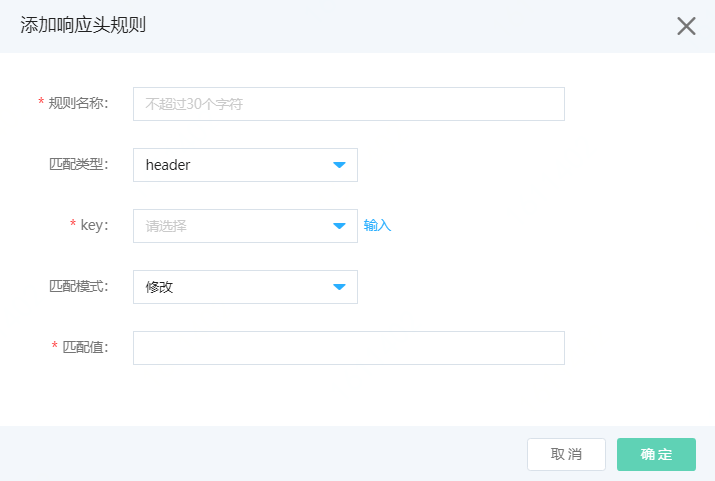

# 设置响应头修改

Web应用防火墙支持响应头的增删改。可以应用到域名支持跨域访问等相关场景。

## 前提条件

- 已开通Web应用防火墙实例，更多信息，请参见[开通Web应用防火墙](https://docs.jdcloud.com/cn/web-application-firewall/purchase-process)。
- 已完成网站接入。更多信息，请参见[添加域名](https://docs.jdcloud.com/cn/web-application-firewall/step-1)。

## 使用限制

包年包月开通的Web应用防火墙实例，其响应头修改功能有以下限制。

| 功能       | 说明                               | 高级版   | 企业版   | 旗舰版   |
| :--------- | :--------------------------------- | :------- | :------- | :------- |
| 响应头修改 | 最多支持添加响应头修改规则的数量。 | 10（条） | 20（条） | 50（条） |

## 操作步骤

1. 登录[Web应用防火墙控制台](https://cloudwaf-console.jdcloud.com/overview/business)。

2. 在左侧导航栏，单击**网站配置**。

3. 在**网站配置**页面定位到要防护的域名，在操作栏单击**防护配置**。

4. 在防护配置页面，单击**流量管理**页签，定位到**响应头**模块，开启**状态**开关。

   

5. 点击**添加规则**，按照下表配置。

   

   | 配置项             | 说明                                                         |
   | ------------------ | ------------------------------------------------------------ |
   | **规则名称**       | 可以输入规则名称，不超过30个字符。                           |
   | **匹配类型**       | 可选**header**和**cookie**                                   |
   | **key**            | 匹配类型是**header**时，支持选择key：Accept、Accept-Language、Access-Control、Authorization、Cache-control、Content-Type、Cookie、Date、Host、Last-Moified、User-Agent、Origin、Referer、Server、Vary等key值，也支持输入key值 匹配类型是**cookie**时，支持输入key值 |
   | **匹配模式 **      | 可以选择**修改**和**删除**两种模式。 当匹配模式是删除时，直接删除，不展示匹配值。 当匹配模式是修改时，将匹配值替换相关key的键值。 |
   | **匹配值**（可选） | 默认填写待替换的字符串。                                     |

