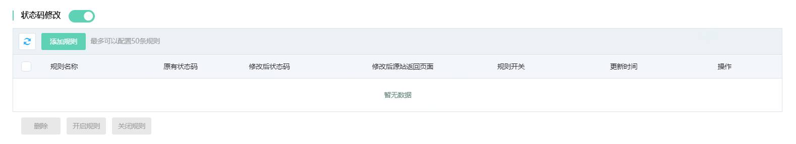
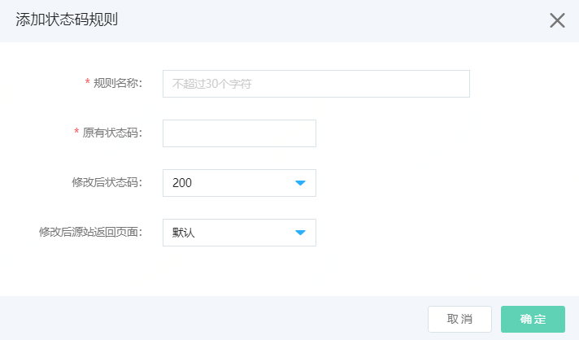
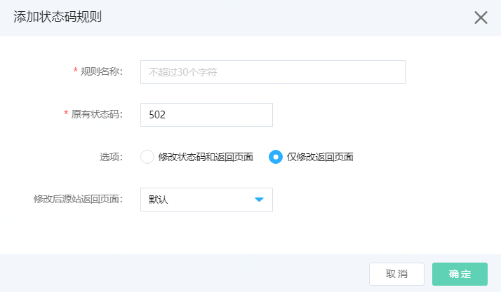

# 设置状态码修改

Web应用防火墙支持状态码修改。可以应用到源站为保障用户体验，不希望用户访问异常页面，如502、504、404等异常状态。此时，源站可以在WAF上设置状态码修改，将502、504等异常状态指向正常状态，并指向一个正常页面。本页主要介绍状态码修改方法。

## 前提条件

- 已开通Web应用防火墙实例，更多信息，请参见[开通Web应用防火墙](https://docs.jdcloud.com/cn/web-application-firewall/purchase-process)。
- 已完成网站接入。更多信息，请参见[添加域名](https://docs.jdcloud.com/cn/web-application-firewall/step-1)。

## 使用限制

包年包月开通的Web应用防火墙实例，其修改状态码功能有以下限制。

| 功能       | 说明                               | 高级版   | 企业版   | 旗舰版   |
| :--------- | :--------------------------------- | :------- | :------- | :------- |
| 状态码修改 | 最多支持添加状态码修改规则的数量。 | 10（条） | 20（条） | 50（条） |

## 操作步骤

1. 登录[Web应用防火墙控制台](https://cloudwaf-console.jdcloud.com/overview/business)。
2. 在左侧导航栏，单击**网站配置**。
3. 在**网站配置**页面定位到要防护的域名，在操作栏单击**防护配置**。
4. 在防护配置页面，单击**流量管理**页签，定位到**状态码修改**模块，开启**状态**开关。

​	5.点击**添加规则**，按照下述指引添加规则。

​	

| 配置项                 | 说明                                                         |
| ---------------------- | ------------------------------------------------------------ |
| **规则名称**           | 可以输入规则名称，不超过30个字符。                           |
| **原有状态码**         | 支持输入400、401、402、403、404，502、503、504，等http状态码。 |
| **选项**（可选）       | 当选择502、504时，会出现选项，可以选择**修改状态码和返回页面**或者**仅修改返回页面**，如下图。  |
| **修改后状态码**       | 默认是200，支持选择302。                                     |
| **修改后源站返回页面** | 当修改后状态码是200等非302状态码时，可以选择默认和自定义页面。 当修改后状态码是302时，返回页面输入当前实例域名下的地址，http（s）开头的。 |