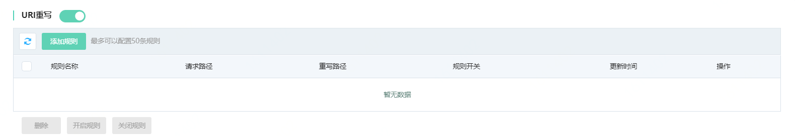
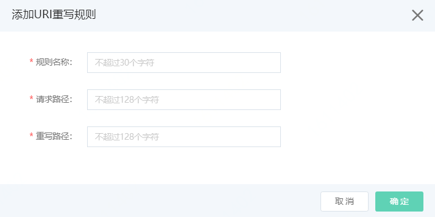

# 设置URI重写

Web应用防火墙支持URI重写。如果源站的资源对外不想暴露资源路径，可以通过URI重写资源路径。

## 前提条件

- 已开通Web应用防火墙实例，更多信息，请参见[开通Web应用防火墙](https://docs.jdcloud.com/cn/web-application-firewall/purchase-process)。
- 已完成网站接入。更多信息，请参见[添加域名](https://docs.jdcloud.com/cn/web-application-firewall/step-1)。

## 使用限制

包年包月开通的Web应用防火墙实例，其URI重写功能有以下限制。

| 功能    | 说明                            | 高级版   | 企业版   | 旗舰版   |
| :------ | :------------------------------ | :------- | :------- | :------- |
| URI重写 | 最多支持添加URI重新规则的数量。 | 10（条） | 20（条） | 50（条） |

## 操作步骤

1. 登录[Web应用防火墙控制台](https://cloudwaf-console.jdcloud.com/overview/business)。

2. 在左侧导航栏，单击**网站配置**。

3. 在**网站配置**页面定位到要防护的域名，在操作栏单击**防护配置**。

4. 在防护配置页面，单击**流量管理**页签，定位到**URI重写**模块，开启**状态**开关。

   

5. 点击**添加规则**，按照下表配置。

   

   | 配置项       | 说明                               |
   | ------------ | ---------------------------------- |
   | **规则名称** | 可以输入规则名称，不超过30个字符。 |
   | **请求路径** | 用户请求的url                      |
   | **重写路径** | 真实请求的url                      |

6.点击**确定**，完成添加规则。