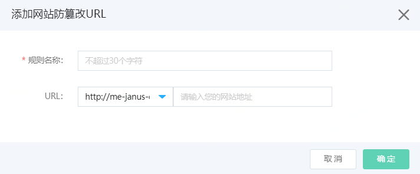
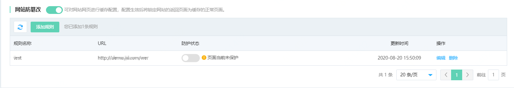
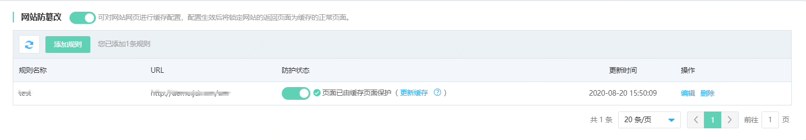

# 设置网页防篡改

网站接入Web应用防火墙后，您可以为其开启网页防篡改功能。网页防篡改帮助您锁定需要保护的网站页面，被锁定的页面在收到请求时，返回已设置的缓存页面，预防源站页面内容被恶意篡改带来的影响。您可以根据实际需求设置网页防篡改的规则。

## 前提条件

- 已开通Web应用防火墙实例，更多信息，请参见[开通Web应用防火墙](https://docs.jdcloud.com/cn/web-application-firewall/purchase-process)。

- 已完成网站接入。更多信息，请参见[添加域名](https://docs.jdcloud.com/cn/web-application-firewall/step-1)。

## 使用限制

包年包月开通的Web应用防火墙实例，其网页防篡改功能有以下限制。

| 功能       | 说明                               | 高级版   | 企业版   | 旗舰版   |
| :--------- | :--------------------------------- | :------- | :------- | :------- |
| 网页防篡改 | 最多支持添加网页防篡改规则的数量。 | 10（条） | 20（条） | 50（条） |

## 操作步骤

1. 登录[Web应用防火墙控制台](https://cloudwaf-console.jdcloud.com/overview/business)。

2. 在左侧导航栏，单击**网站配置**。

3. 在**网站配置**页面定位到要防护的域名，在操作栏单击**防护配置**。

4. 在防护配置页面，单击**网站合规**页签，定位到**网页防篡改**模块，开启**状态**开关，并点击**添加规则**。

   

   **说明** 必须先开启网站防篡改，防护规则才能生效。

5. 新增网页防篡改规则。

   1. 在**网页防篡改**页面，单击**添加规则**。

   2. 在**添加规则**对话框，输入要防护的网页对应的**规则名称**和**URL**。

      - **规则名称**：输入规则名称，不超过30个字符。
      - **URL**：URL前缀可以选择http或https协议，后面填写精确的要防护的路径，不支持通配符（例如`/*`）或参数（例如`/abc?xxx=`）。

      

   3. 单击**确定**。

   成功添加网页防篡改规则后，规则默认不开启。您可以在规则列表中看到新建的规则，且其**防护状态**开关未开启。

   

6. 开启规则。在规则列表中定位到要开启的规则，开启其**防护状态**开关。

   成功开启规则后，规则对应的页面被请求时，将统一返回Web应用防火墙中的缓存记录。

   

7. 可选：

   更新缓存。在规则列表中定位到已开启的规则，单击其**防护状态**列下的**更新缓存**。

   **注意** 如果被防护页面发生内容更新，您必须单击 **更新缓存**更新Web应用防火墙中的缓存记录。如果您在页面更新后未更新缓存，Web应用防火墙将始终返回最近一次缓存的记录。