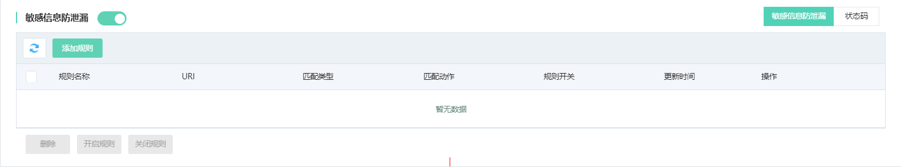
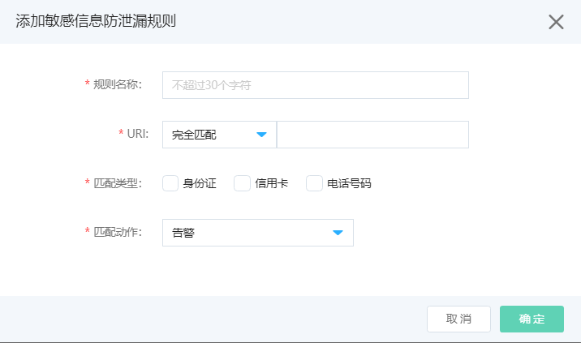

# 设置敏感信息防泄漏

网站接入Web应用防火墙后，您可以为其开启敏感信息防泄露功能。敏感信息防泄露帮助网站过滤服务器返回内容中的敏感信息（例如身份证号、银行卡号、电话号码），脱敏展示敏感信息或告警。您可以根据实际需求设置防敏感信息泄露的规则。

## 前提条件

- 已开通Web应用防火墙实例，实例套餐必须是高级版及以上规格，更多信息，请参见[开通Web应用防火墙](https://docs.jdcloud.com/cn/web-application-firewall/purchase-process)。
- 已完成网站接入。更多信息，请参见[添加域名](https://docs.jdcloud.com/cn/web-application-firewall/step-1)。

## 背景信息

敏感信息防泄漏功能是Web应用防火墙针对网安法提出的“网络运营者应当采取技术措施和其他必要措施，确保其收集的个人信息安全，防止信息泄露、毁损、丢失。在发生或者可能发生个人信息泄露、毁损、丢失的情况时，应当立即采取补救措施，按照规定及时告知用户并向有关主管部门报告”所给出的安全防护方案。敏感信息防泄漏针对网站中存在的敏感信息（尤其是电话号码、身份证、信用卡）泄漏、敏感词汇泄露提供脱敏和告警措施。

包年包月开通的Web应用防火墙实例，其敏感信息防泄漏功能有以下限制。

| 功能           | 说明                                     | 高级版   | 企业版   | 旗舰版   |
| :------------- | :--------------------------------------- | :------- | :------- | :------- |
| 敏感信息防泄漏 | 最多支持添加的敏感信息防泄漏规则的数量。 | 10（条） | 20（条） | 20（条） |

## **工作原理**

敏感信息防泄露按照配置好的防护规则，检测响应页面中是否带有身份证号、电话号码、银行卡号等敏感信息，并在发现敏感信息匹配命中后，根据规则中指定的匹配动作触发告警或者敏感信息过滤。敏感信息过滤动作指以*号替换敏感信息部分，达到保护敏感信息的效果。

## 操作步骤

1. 登录[Web应用防火墙控制台](https://cloudwaf-console.jdcloud.com/overview/business)。

2. 在左侧导航栏，单击**网站配置**。

3. 在**网站配置**页面定位到要防护的域名，在操作栏单击**防护配置**。

4. 在防护配置页面，单击**网站合规**页签，定位到**敏感信息防泄漏**模块，开启**状态**开关，并点击**添加规则**。

   

5. 添加敏感信息防泄露规则。在添加规则对话框，完成以下规则配置。

   

   | 配置项       | 说明                                                         |
   | :----------- | :----------------------------------------------------------- |
   | **规则名称** | 为规则命名。                                                 |
   | **URI**      | 填写要指定检测的URI，即只在指定的页面检测敏感信息。 填写：匹配方式+路径 匹配方式可选：**完全匹配**、**前缀匹配**和**包含匹配**。 |
   | **匹配类型** | 选择要在请求响应中检测匹配的敏感信息类型，可选敏感信息值：**身份证**、**信用卡**、**电话号码**。 **说明**：**电话号码**目前仅支持中国内地的手机号。 |
   | **匹配动作** | 定义在请求响应中检测到敏感信息后执行的操作。支持以下匹配动作： **告警**：不处理敏感信息，仅记录日志。 **敏感信息过滤**：脱敏请求响应中的敏感信息。 |

