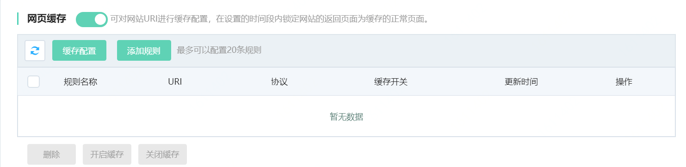
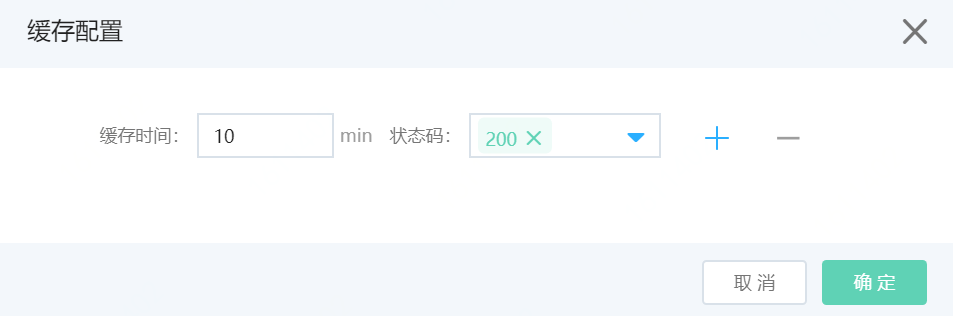
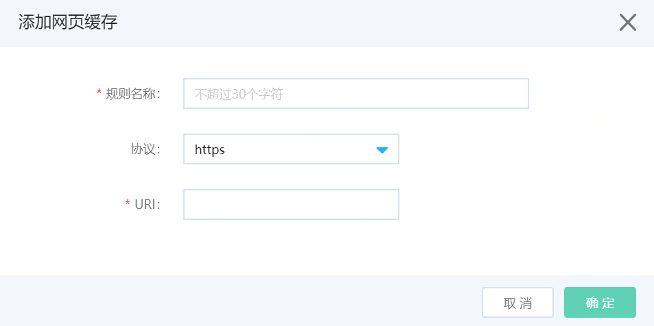

# 设置网页缓存

网站接入Web应用防火墙后，您可以为其开启网页缓存功能。网页缓存帮助您提高网页访问速度，减轻源站压力。您可以根据实际需求设置网页缓存的规则。

## 前提条件

- 已开通Web应用防火墙实例，更多信息，请参见[开通Web应用防火墙](https://docs.jdcloud.com/cn/web-application-firewall/purchase-process)。

- 已完成网站接入。更多信息，请参见[添加域名](https://docs.jdcloud.com/cn/web-application-firewall/step-1)。

包年包月开通的Web应用防火墙实例，其网页缓存功能有以下限制。

| 功能     | 说明                               | 高级版   | 企业版   | 旗舰版   |
| :------- | :--------------------------------- | :------- | :------- | :------- |
| 网页缓存 | 最多支持添加的网页缓存规则的数量。 | 10（条） | 20（条） | 20（条） |

## 操作步骤

1. 登录[Web应用防火墙控制台](https://cloudwaf-console.jdcloud.com/overview/business)。

2. 在左侧导航栏，单击**网站配置**。

3. 在**网站配置**页面定位到要防护的域名，在操作栏单击**防护配置**。

4. 在防护配置页面，单击**网站缓存**页签，定位到**网页缓存**模块，开启**状态**开关，并点击**添加规则**。

   

5. 点击**缓存配置**，设置缓存配置，如下图。缓存配置对所有缓存规则生效，可以设置：
   

   - **缓存时间**：页面缓存时长，缓存时长以内用户请求将返回Web应用防火墙中的缓存记录。
   - **状态码**：访问URI时，返回指定的状态码页面时才会被缓存。

6. 点击**添加规则**，添加网页缓存规则。

   

   - **规则名称**：可以输入规则名称，不超过30个字符。
   - **协议**：支持选择http/https协议。
   - **URI**：输入完整精确的URI，不支持通配符（例如`/*`）或参数（例如`/abc?xxx=`）。

   7.点击**确定**，添加规则。

   

   