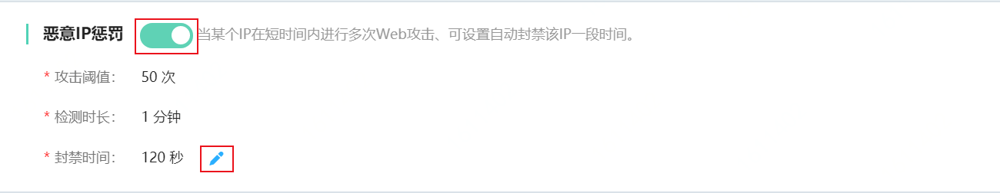

# 开启恶意IP惩罚

接入Web应用防火墙后，如果需要自动封禁在短时间内进行多次Web攻击的客户端IP，您可以开启恶意IP惩罚。传统的Web应用防火墙针对IP-URL维度进行拦截。当判定一个请求是攻击行为后，单次阻断该请求。而实际上，攻击者们可能利用多IP持续不断地在对您的网站进行Web攻击，单次阻断往往不够高效。针对这种情况，WAF提供恶意IP惩罚功能。当一个IP被WAF识别到正在进行持续的Web攻击行为时，WAF帮助您自动封禁在短时间内进行多次Web攻击的客户端恶意IP。本文主要介绍恶意IP惩罚的开启和设置。

## 前提条件

- 已开通Web应用防火墙实例。更多信息，请参见[开通Web应用防火墙](https://docs.jdcloud.com/cn/web-application-firewall/purchase-process)。
- 已完成网站接入。更多信息，请参见[添加网站](https://docs.jdcloud.com/cn/web-application-firewall/step-1)。

## 操作步骤

1、登录[Web应用防火墙控制台](https://cloudwaf-console.jdcloud.com/overview/business)。

2、在左侧导航栏，单击**网站配置**。

3、在**网站配置**页面定位到要设置的域名，在操作栏单击**防护配置**。

4、在防护配置页面，打开**Web防护**页签，定位到**恶意IP惩罚**模块，开启开关如下图。点击蓝色笔按钮，可以修改防护阈值。

- **攻击阈值**：设置统计Web攻击阈值，在检测时长内，超过Web攻击阈值时，将对其进行封禁。

- **检测时长**：检测的单位时长。

- **封禁时间**：拦截攻击IP访问Host的时间。

  上图设置的含义是：每1分钟统计IP的Web攻击次数，超过50次时，对IP进行封禁，120s内此IP访问Host将会被拦截。

