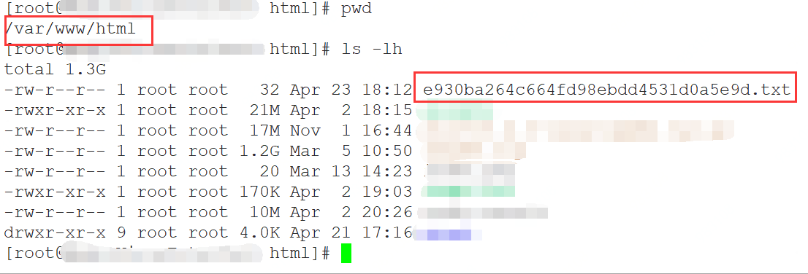

# 认证文件加入web目录问题

### 1、如何将子域名资产的认证文件加入web目录？

在进行您的子域名资产扫描前，需要针对子域名进行资产认证。需要将您下载的资产认证文件上传至对应网站资产的根目录，即：网站资产首页index文件的同级目录下。

由于不同用户使用的服务器各不相同，文件上传的位置有所不同，请参照以下方法完成认证文件的上传。

#### （1）常见服务器类型

| 服务器类型       | 根目录                                              |
| ---------------- | --------------------------------------------------- |
| IIS服务器类型    | 默认位置：“C:\inetpub\wwwroot”，具体以实际情况为准  |
| Tomcat服务器类型 | Tomcat的部署地址/webapps/ROOT/                      |
| Apache服务器类型 | 默认位置：“/var/www/html”，具体以实际情况为准       |
| Nginx服务器类型  | 默认位置：/usr/share/nginx/html，具体以实际情况为准 |

#### （2）认证文件加入web目录步骤

- 登录网站所使用的服务器。

  > 如果是非root用户，登录后，执行su -root命 令切换到root用户。

- 找到网站所使用的服务器的根目录，即“index”文件的同级目录。

- 将认证文件保存在服务器类型对应的目录下

> 举例说明：
>
> - 进入网站所使用的服务器的根目录：cd /var/www/html
> - 新建一个同域名认证文件同名的文件：vi e930ba264c664fd98ebdd4531d0a5e9d.txt
> - 进入编辑模式：i，将准备好的认证文件内容粘贴到此处。
> - 保存并退出编辑模式：按“Esc”退出编辑，输入:wq保存并退出。
> - 查看认证文件是否上传成功：ll
>
> 
>
> - 在浏览器中输入您的网站资产
>
>   “http://test.example.com/e930ba264c664fd98ebdd4531d0a5e9d.txt”
>
>   访问验证认证文件是否上传成功，如果能成功访问，则表示上传成功。
