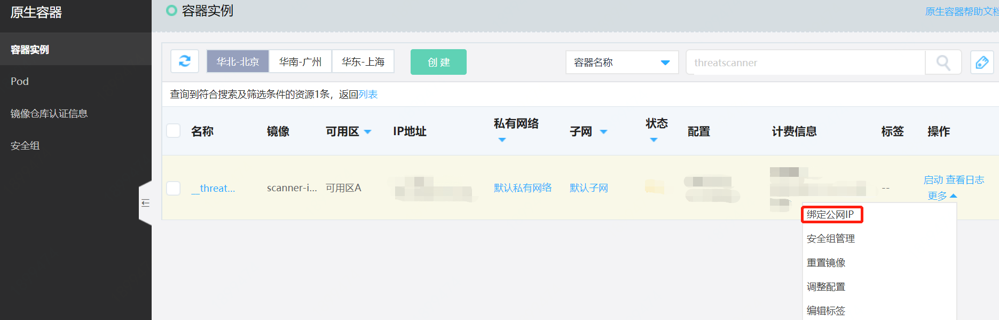

# 探针部署问题

### 1、为什么VPC内网探针部署完成离线？

- 探针部署完成，部署状态显示离线，需要您进行如下操作：

  - 前往“云服务-原生容器“进行公网IP的绑定
    

  - 找到网站威胁扫描产品创建的容器实例
    

  - 在“操作-更多”中绑定公网IP
    

- 如果您发现没有空余的公网IP可以使用，需要您进行公网IP申请

  - 申请方式：“云服务-私有网络-弹性公网IP”
    

  - 对具体公网IP的申请方式没有要求，您可以按需选择包年包月或按量付费等方式。
