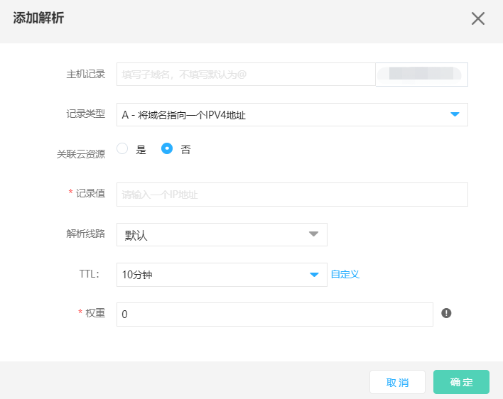

# 资产认证问题

### 1、什么样的资产需要认证？

- 针对未注册在京东智联云域名解析服务的下的域名/子域名相关信息，需要您手动添加，认证。

### 2、如何对目标扫描域名进行验证？

- 添加项是主域名，通过CNAME方式认证

（1）注册域名

如果您需要在京东智联云进行域名注册，可参考域名服务文档进行操作。
帮助文档：https://docs.jdcloud.com/cn/domain-name-service/register-domain-name

（2）如何进行主域名认证？

您需要您的主域名下新增CNAME解析记录example.mysite.com至testtest.verify.jdcloudscan.com以完成添加资产的认证。

| 需要填写字段内容 | 样例                                   |
| ---------------- | -------------------------------------- |
| 记录类型         | CNAME                                  |
| 主机记录         | c2a479945eb42536cf5c51d44af25a9f       |
| 记录值           | f5be287a4345f56.verify.jdcloudscan.com |
| 操作             | 保存                                   |

- 添加项是子域名，通过文件方式认证

可参考帮助文档常见问题：[认证文件加入web目录问题](../../../../documentation/Cloud-Security/Website-Threat-Inspector/FAQ/AddWebDirectory.md)

