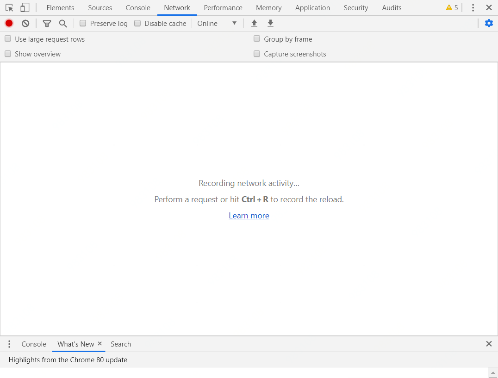
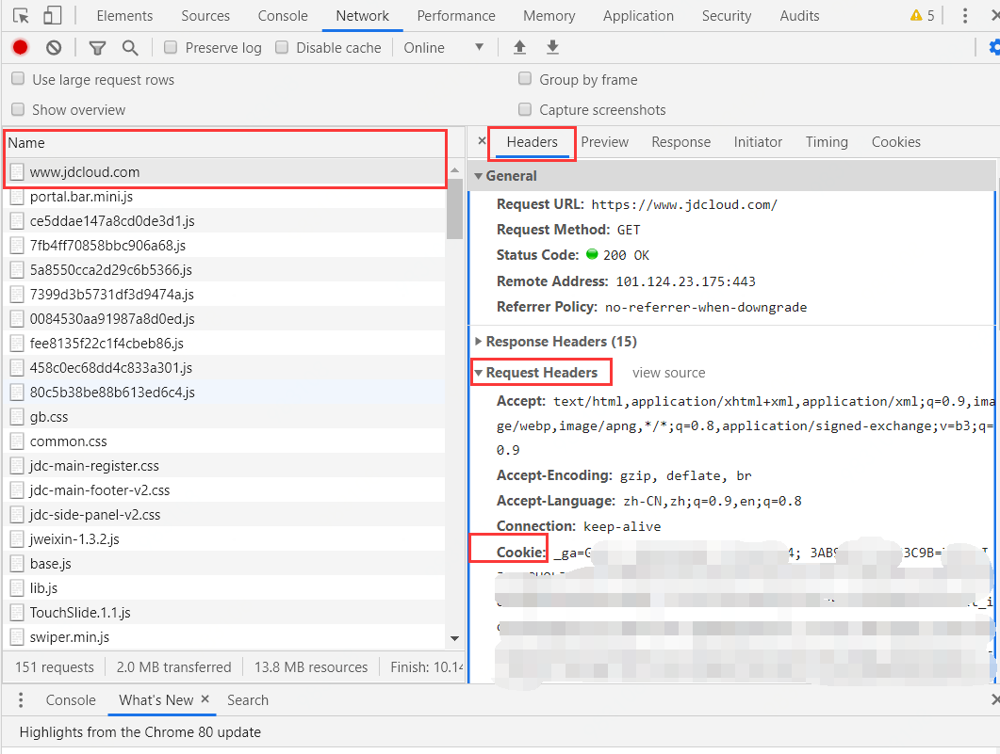
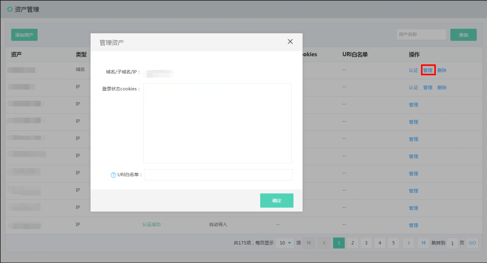

# Cooike认证问题

### 1、如何获取网站cookie值？

- 打开Google Chrome浏览器。

- 按“F12”，进入浏览器的开发者模式。

- 在调试页面中，选择“Network” ，如图所示。

- 在地址栏中输入目标网站地址“www.jdcloud.com” ,并进行登陆

- 在左侧导航树中，选择一个http请求。 如图选择www.jdcloud.com . 再一次点击 Headers -> Request-Headers -> Cookie。  cookie 里面的内容即我们想要获取的Cookie

### 2、扫描前怎么设置cookie值？

- 网站威胁扫描云服务-> 资产管理-> 点击要添加cookie资产的“管理”按钮 -> 登录状态cookies 输入框内，输入要添加的cookie

### 3、网站cookie值发生变化时，如何进行网站漏洞扫描？

- 如果网站的cookie值发生了变化，请按照获取cookie值以及设置cookie值的方式设置新的cookie
