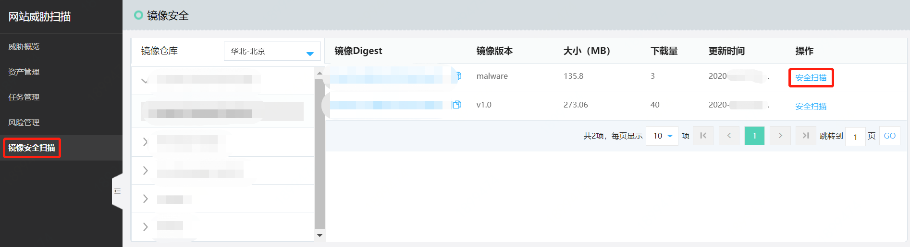
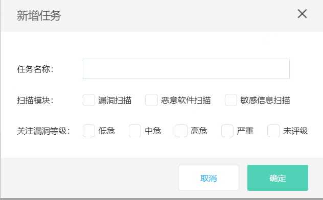
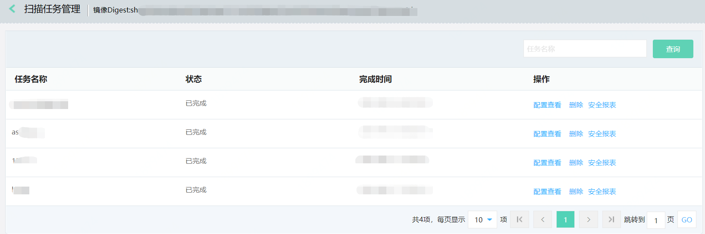
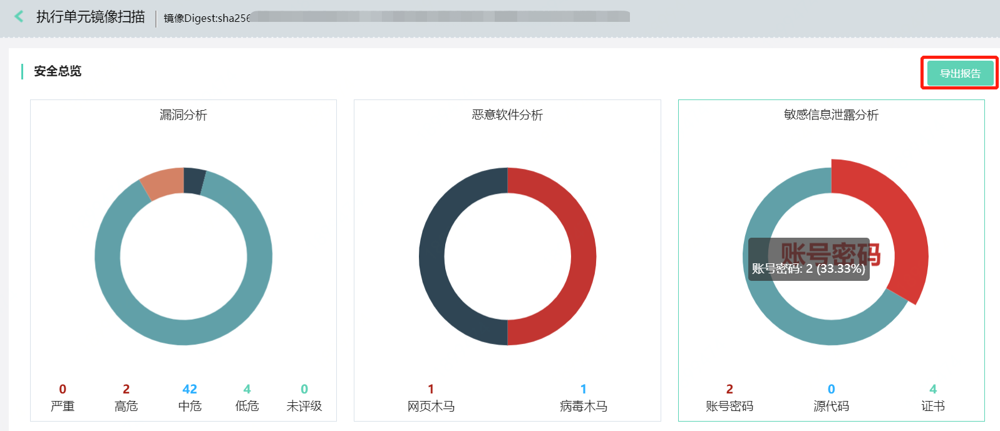
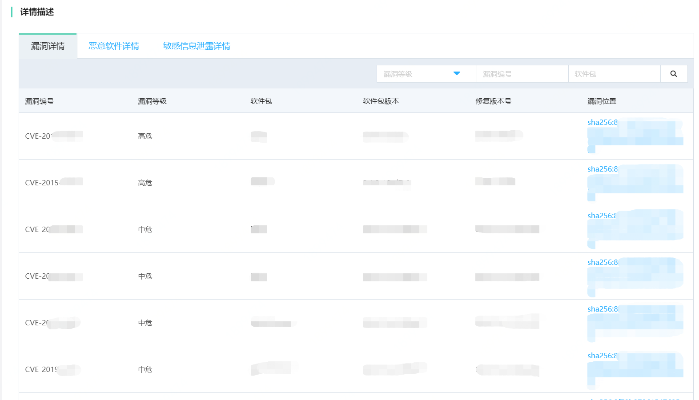
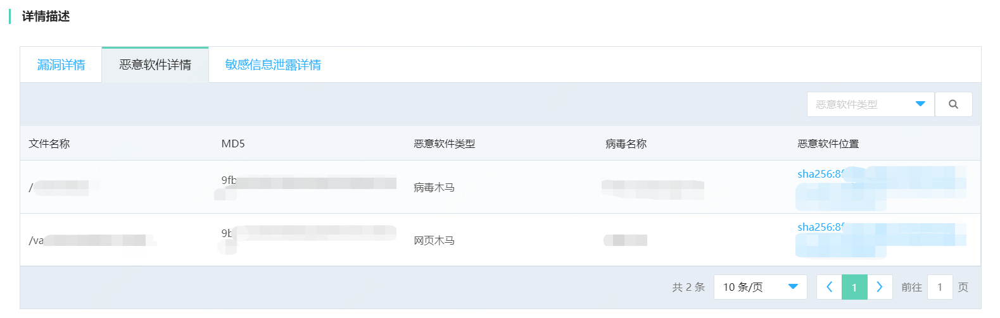
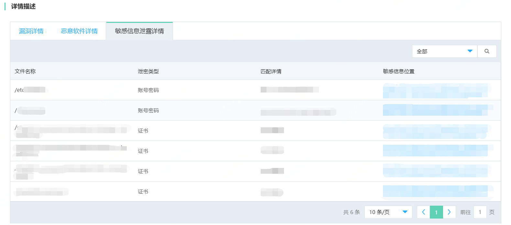

# 扫描容器镜像资产

​		针对您在京东智联云上使用的容器镜像文件进行安全扫描，以保障您的容器镜像文件安全，对容器镜像文件资产进行安全扫描与漏洞分析，是构建容器安全中不可缺少的一环。

## 1、容器镜像扫描前置条件

- 仓库支持获取区域：目前支持在华北（北京）、华东（上海）、华南（广州）三个区域获取区域下的仓库镜像。
- 创建管理注册表与镜像仓库：详见容器镜像仓库产品文档：https://docs.jdcloud.com/cn/container-registry/product-overview

## 2、容器镜像扫描操作步骤

### （1）创建安全扫描任务

点击左侧菜单栏中“镜像安全扫描”，选择镜像仓库中某一个镜像，点击右侧“操作”按钮，进行安全扫描任务创建。

根据镜像种类的不同，在创建的扫描任务中，灵活配置“镜像扫描模块”与“关注漏洞等级”，点击确认。

| 扫描任务配置 | 配置内容                             |
| ------------ | ------------------------------------ |
| 镜像扫描模块 | 漏洞扫描、恶意软件扫描、敏感信息扫描 |
| 关注漏洞等级 | 低危、中危、高危、严重、未评级       |

### （2）管理镜像扫描任务

点击镜像Digest，进行该镜像扫描任务管理，可以进行配置查看、任务删除、查看安全报表等操作。

### （3）查看镜像安全报表

点击“镜像扫描任务管理”右侧操作选项中的“安全报表”，可以进行该镜像资产的安全报表查看与导出。

- 安全总览

可以查看已扫描的镜像资产，当前存在的各类安全风险（安全漏洞、恶意软件、敏感信息泄露）

| 安全风险总览     | 分类风险内容分类               |
| ---------------- | ------------------------------ |
| 安全漏洞分析     | 严重、高位、中危、低危、未评级 |
| 恶意软件分析     | 网页木马、病毒木马             |
| 敏感信息泄露分析 | 账号密码、源代码、证书         |

点击左上角的导出报告，可以导出针对该容器镜像的本次扫描任务的扫描报告。

- 详情描述

在详情描述中，可以查看针对镜像扫描文件目标，在本次扫描任务中的风险详情。

| 风险详情分类     |                                                              |
| ---------------- | ------------------------------------------------------------ |
| 漏洞详情         | 漏洞编号、漏洞等级、软件包、软件包版本、修复版本号、漏洞位置 |
| 恶意软件详情     | 文件名称、MD5、恶意软件类型、病毒名称、恶意软件位置          |
| 敏感信息泄露详情 | 文件名称、泄密类型、匹配详情、敏感信息位置                   |

- - 漏洞详情

- - 恶意软件详情

- - 敏感信息泄露详情

