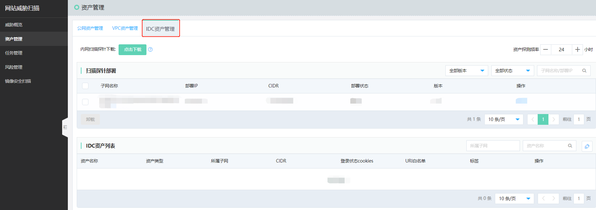
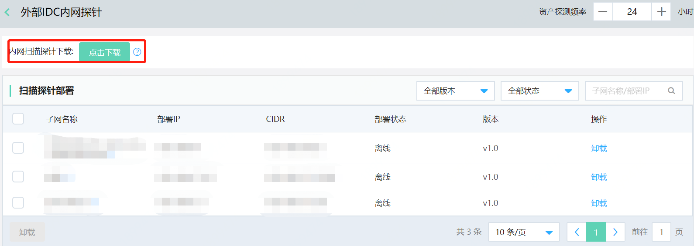
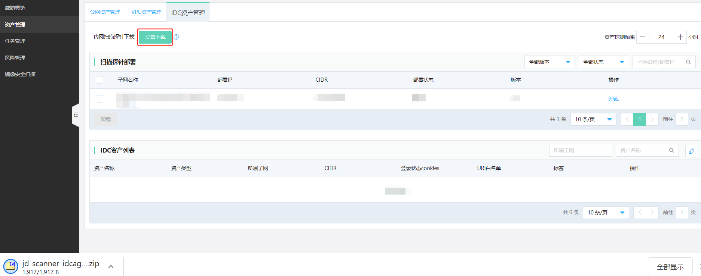

# 扫描外部IDC内网资产

​		针对您部署在自身本地机房或IDC机房的未上云的资产， 可以通过部署外部IDC内网探针的方式，进行IDC内网资产扫描，能够满足您了解掌握未上云的资产风险状态的需要。

​		从而通过单一的网站威胁扫描控制台，集中管理云上资产、提供互联网服务的域名/IP资产，外部IDC内网资产的整体风险状态。

## 部署外部IDC内网探针

- 添加外部IDC内网探针

  登录控制台，选择左侧【资产管理】，点击IDC资产管理

- 下载外部IDC内网探针

  选择内网扫描探针，点击下载，每部署一个子网需重新下载，

- 安装外部IDC内网探针

  下载完成，解压缩下载文件（jd_scanner_idcagent.zip），手动在安装的资产设备上执行安装脚本。

- 查看外部IDC内网探针状态

  安装完成后，通过互联网互联互通，在网站威胁扫描产品控制台上，就可以看到部署在IDC内网的探针状态，并可进行筛选、检索、管理。

- 选择资产探测频率

  您可以根据扫描监控IDC内网资产的实际业务情况，选择资产探测频率，默认为24小时。

