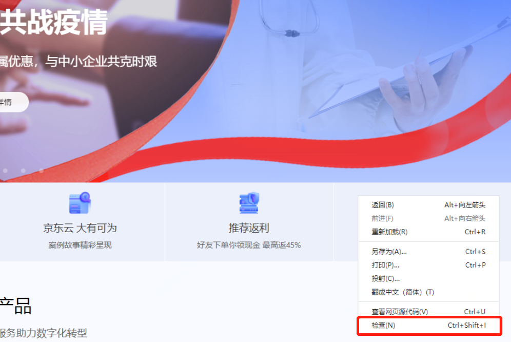
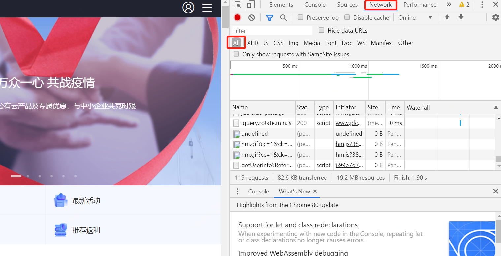
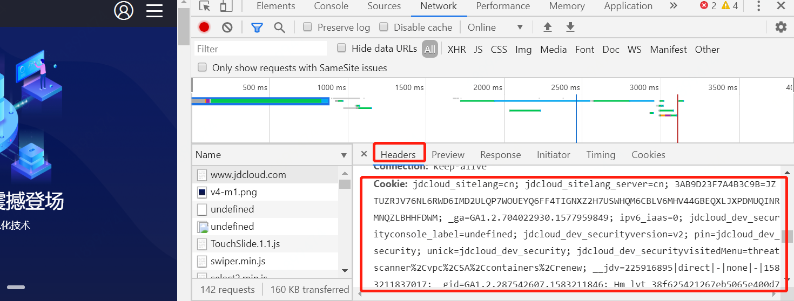

# 添加扫描公网资产

## 1、公网资产支持情况：

- 支持IP、域名两类资产
- 支持 HTTP 和 HTTPS 两类协议
- 支持多级子域名网站
- 支持多级子目录网站

## 2、公网资产添加场景：

### （1）场景1：添加注册在京东智联云域名解析服务下的资产

针对注册在京东智联云域名解析服务下的域名/子域名相关信息，产品自动导入，无需手动添加，无需认证。

### （2）场景2：添加注册在本账号下的资产

针对注册在本账号下的公网IP地址，产品自动导入，无需手动添加，无需认证。

### （3）场景3：添加注册在其他域名解析服务下的资产

针对未注册在京东智联云域名解析服务的下的域名/子域名相关信息，需要您手动添加，认证。

- 添加项是主域名，通过CNAME方式认证
- 添加项是子域名，通过文件方式认证

## 3、操作步骤：

### （1）步骤1：添加公网资产

注：如果您添加的资产属于不在京东智联云域名解析服务的下注册的资产，需要您手动添加，认证

进入网站威胁扫描控制台，在左侧导航栏，单击【资产管理】，在网站管理页面，单击【添加公网资产】

注：您同一个账号下的域名和IP资产，在资产列表中可以自动关联发现，无需手动添加

### （2）步骤2：填写资产信息与认证路径

域名/子域名/IP：根据您网站的访问方式选择您要添加的资产类型（如：example.com、test.examlple.com、116.196.104.180）

资产认证路径：针对手动添加的资产，需要对该资产进行身份认证，确保待扫描均为租户名下的资产。认证路径默认为根目录，如根路径存放认证文件不便，则可自定义相关路径。

### （3）步骤3：认证公网资产

- ##### 主域名添加解析

需要在您的主域名下，新增CNAME解析记录（以1.1.1.12地址为例）

f3d40a15facc466593e32ee91f57f974.1.1.1.12 至df0b08b86088a0f781faade30269a78a.verify.scanner.jdcloud.com以通过主域名资产认证。

- ##### IP/子域名添加认证

（1）点击获取认证文件 ，将认证文件（jd_scanner_verify.html）下载到本地。

（2）将下载的认证文件上传 ，请勿修改文件名称和内容

（3）确保能从公网访问该文件；点击【点击访问】即可验证认证是否成功 。

### （4）步骤4：配置需要登录的资产

如果您的某些资产或某个资产中的部分内容需要登录后查看，则建议在开启扫描任务之前，对这些登录后查看的内容，进行额外配置（登录后的cookies内容），以完成全面的扫描。

产品支持管理资产的登录状态，为您的目标资产填写登录状态信息，当目标资产登录状态的cookies内容配置成功后，可帮助您深入检测发现资产被登录后的漏洞风险。

在认证完成后，您也可以添加需要登录的资产，点击【管理】，弹出管理资产界面，填写登录状态cookies内容。

> ##### 如何填写登录状态的cookies内容？
>
> 1、请先使用 Chrome 浏览器成功登录您的网站，访问一个登录后才能继续访问的页面，使用 F12按键或在页面右键选择 “检查”。
>
> 
>
> 2、在出现的开发者工具中选择 “Network-All”，并刷新页面。
>
> 
>
> 3、单击排在第一的网络请求。在 “Headers” 中找到 “Cookie” 这一项，拷贝它的值，粘贴至模拟登录弹窗中的 “登录状态 Cookies”。
>
> 

### （5）步骤5：配置URI白名单

URI白名单：指当页面地址包含这些关键词时，禁止网站威胁扫描产品访问，以防止退出登录或访问管理后台。

配置URI白名单可以指定产品不爬取的页面，如：/logout.php，此处填写logout。 

匹配模式采取全量匹配的方式，即logout1.php 不会被排除。
