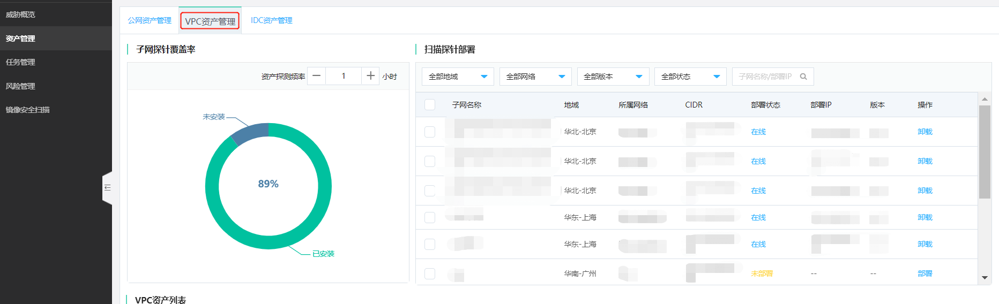
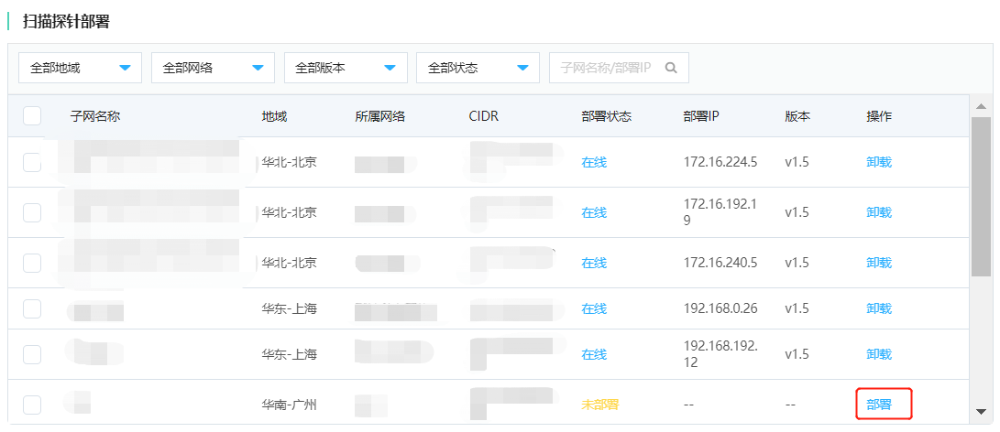
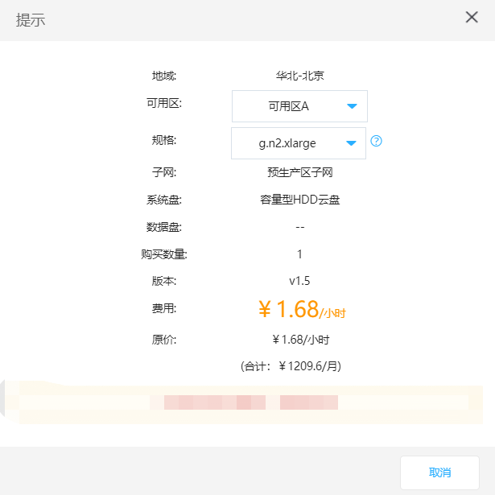
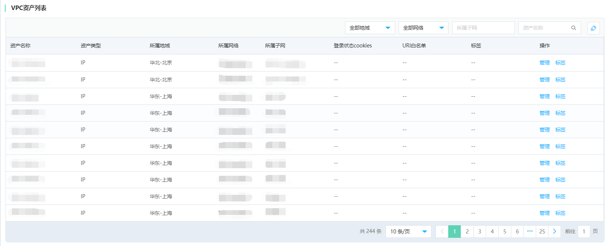

# 扫描京东智联云内网资产

​	针对您部署在京东智联云上的公有云资产， 可以通过部署VPC子网探针的方式，进行VPC内网资产扫描，能够满足您了解掌握内网资产风险状态的需要。

## 1、VPC探针部署区域

​	目前支持在华北（北京）、华东（上海）、华南（广州）三个区域部署内网探针，华东（宿迁）区域暂不支持。

## 2、操作步骤

### （1）添加部署VPC扫描探针

登录控制台，选择左侧【资产管理】，点击VPC资产管理

在部署内网探针页可以对VPC内网探针进行检索管理

- 探针检索

  通过筛选资产所在区域、探针版本信息、部署状态等维度，可以直观查找当前用户pin下，各个区域子网探针的部署情况。

| 检索维度 | 检索项                                                 |
| -------- | ------------------------------------------------------ |
| 地区     | 华北（北京）、华东（上海）、华南（广州）               |
| 版本     | 全部版本、V1.0等                                       |
| 状态     | 全部状态，在线、离线、部署中、部署失败、卸载中、未部署 |

### （2）按需选择VPC扫描规格

- 部署子网探针

  选择部署区域、子网名称，点击【部署】操作，进行探针部署。

- 选择部署实例规格

  部署的内网探针，会以原生容器的实例载体进行部署，可以在选定区域子网中，按需选择可用区、容器实例的规格。

| 可用区选择 | 可选择项                  |
| ---------- | ------------------------- |
| 可用区     | 可用区A、可用区B、可用区C |

- 原生容器规格

| 原生容器规格选择 | 子网包含可用IP规模                 |
| ---------------- | ---------------------------------- |
| g.n2.medium      | 子网包含可用IP规模小于256个        |
| g.n2.xlarge      | 子网包含可用IP规模在256~1024个之间 |
| g.n2.2xlarge     | 子网包含可用IP规模在1024~4096之间  |
| g.n2.4xlarge     | 子网包含可用IP规模在大于4096个     |

注：内网扫描探针创建成功后，将在弹性计算->原生容器中创建__threatscanner_detect_nc__的容器，在弹性计算->云硬盘中创建__threatscanner_detect_disk__的硬盘，请勿删除。

- VPC扫描探针部署费用说明

> 您可以根据VPC内网资产业务的实际情况，就VPC扫描资产所在网段部署相关扫描探针，扫描探针以容器实例为载体部署于您的租户环境内，故针对容器实例的资源消耗，需要单独支付相关费用。

> 扫描探针的容器计算实例使用**按量计费**方式，当您的内网资产扫描发现完成后，且所在网段资产不发生变更，您可以进行卸载扫描探针以节省费用。

> 但该网段内的内网ip资产以下列vpc资产列表为准，一旦该网段发生资产新增或变更，则需要部署扫描探针重新进行资产发现探测。为了保证内网IP资产获取的实时性与准确性，建议您保持扫描探针的部署在线状态。

