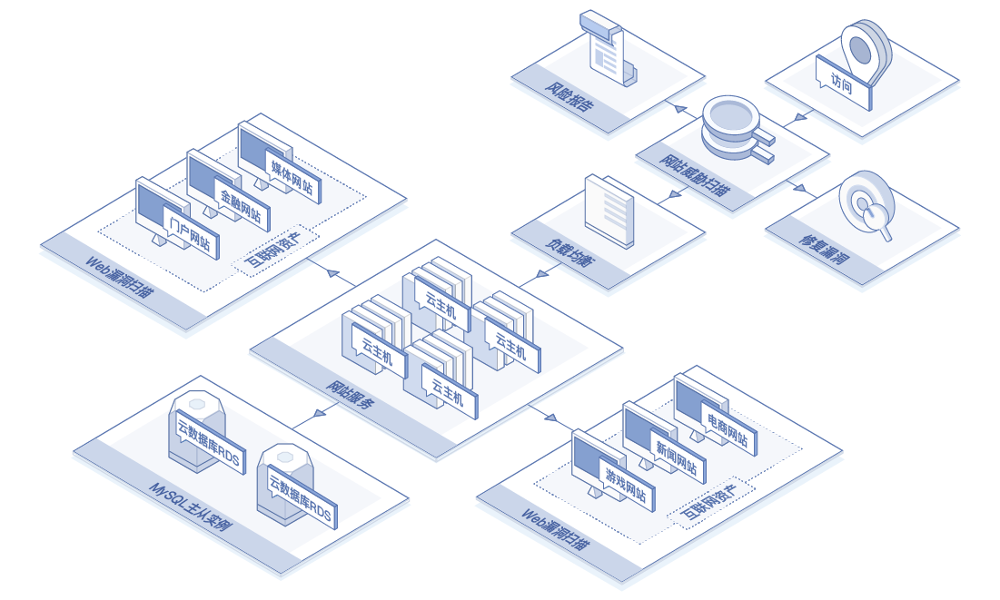
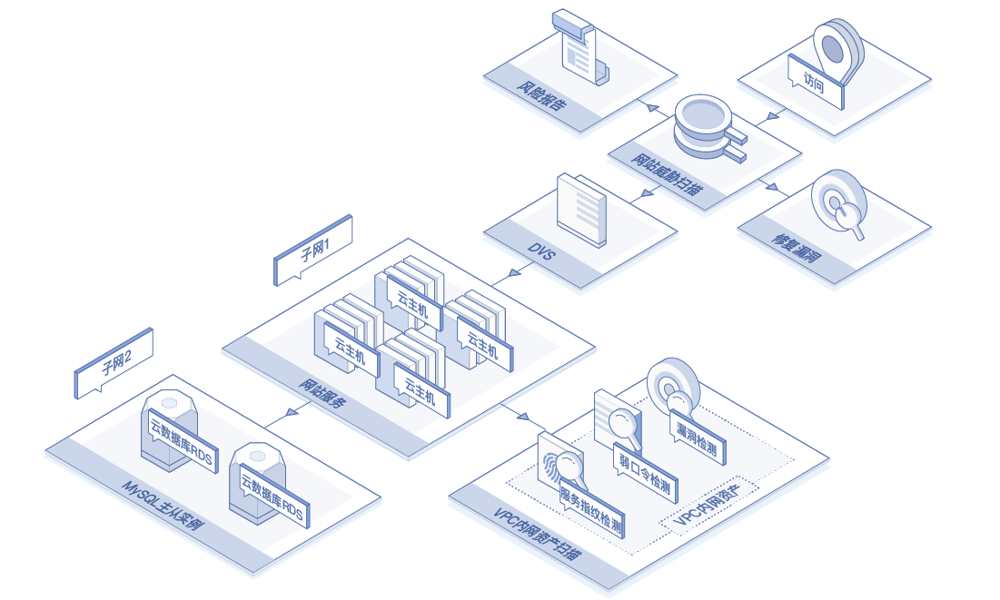
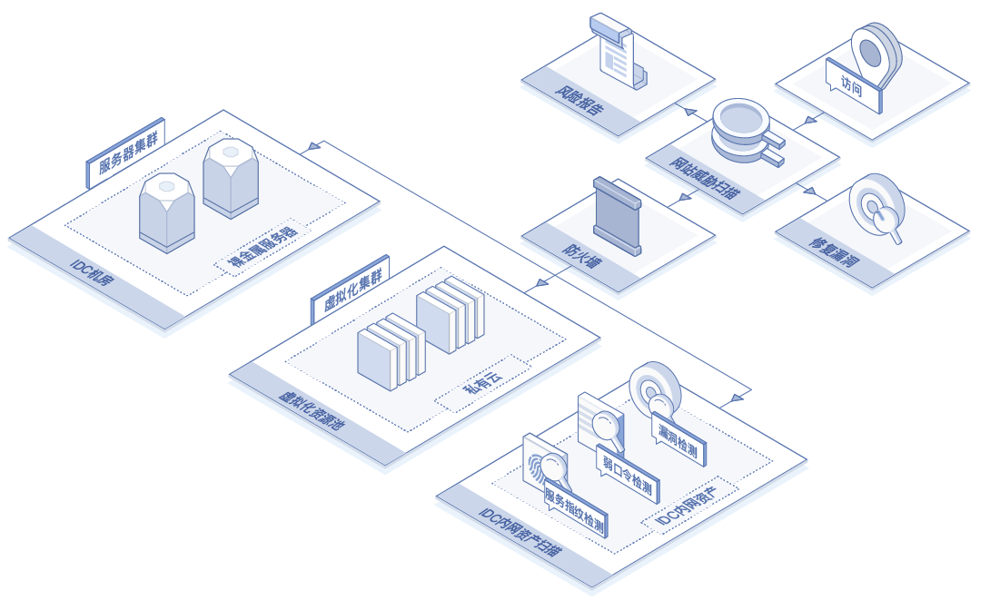

# 应用场景

- **各类企业网站扫描应用场景**

  越来越多的企业面临的新型威胁和攻击不断增长，Web应用作为互联网上最重要的应用形式，Web应用的安全直接影响着业务发展的可持续性。

  网站的漏洞与弱点易于被黑客利用，形成攻击，带来不良影响，造成经济损失。网站威胁扫描产品基于数据分析统计模型和先进的漏洞扫描引擎，为企业输出全面的漏洞检测报告，并给出专业的修复建议，可以有效避免漏洞被黑客利用。

  产品不仅能够针对常规漏洞进行扫描，拥有丰富的漏洞规则库，可针对各种类型的网站进行全面深入的漏洞扫描，同时提供专业全面的扫描报告；此外，还可以进行扫描最新紧急的漏洞，针对最新爆发的0-Day漏洞，安全专家第一时间分析漏洞、更新规则，提供最快速专业的漏洞扫描插件。

- **云上VPC内网扫描应用场景**

  随着企业不断将自身业务逐渐迁移上云，云上网络拓扑一般分为业务访问、外网访问和管理访问，云内各类应用系统都封装到VPC的虚拟局域网（VLAN）中，当前大部分公有云漏洞扫描的解决方案是通过互联网扫描暴露在公网的IP或域名。针对云内的网络架构，大都束手无策。

  有鉴于此，京东智联云网站威胁扫描产品推出了针对云内VPC内网的资产支持威胁扫描的场景，并可以结合态势感知产品进一步评估云内的整体安全态势。进而达到先于黑客了解内网资产漏洞的目的，同时减少内部网络的攻击面，降低云上内网横向攻击渗透风险。

- **外部IDC资产扫描应用场景**

  在企业将业务逐步迁移上云的过程中，对于企业来说，在一段相当长的时间内，都存在一部分业务已迁移上云，而也有一部分业务还在本地机房或托管在IDC机房中。然而对于企业运维人员的资产漏洞风险管理运维，无疑增加了不小的工作量。

  有鉴于此，京东智联云网站威胁扫描产品推出了针对用户IDC机房的资产支持威胁扫描的场景，只需要手动下载快速部署探针，并在外部IDC环节中手动部署后，就可以通过京东智联云网站威胁扫描产品，集中管理分布在外部IDC资产漏洞风险状态。

