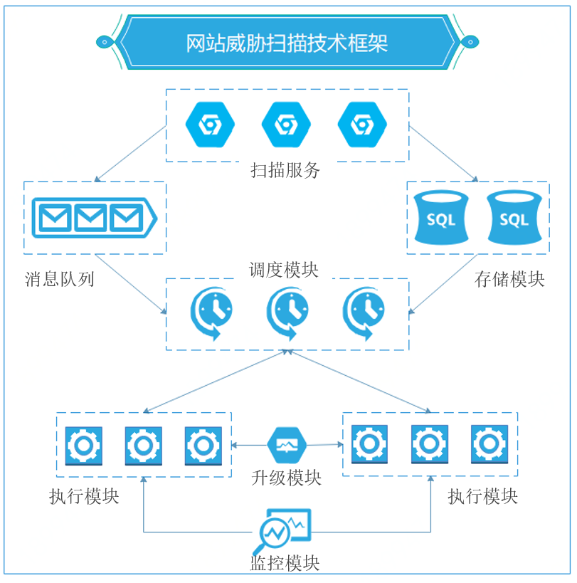

# 产品架构

## 松耦合设计理念

网站威胁扫描产品采用松耦合的设计理念，主要分为API模块、调度模块、执行模块三大模块，数据存储采用Redis与MySQL两类存储方式。各个组件的功能如下：

| 模块             | 功能                                                         |
| ---------------- | ------------------------------------------------------------ |
| API模块          | 负责对接服务，所有产品配置、获取类别的请求都通过API接口进行  |
| 调度模块         | 调度是产品的“核心”模块，负责执行单元的信息收集、状态监控，任务获取、任务分发等工作 |
| 执行模块       | 主要负责执行，执行调度模块分派下来的任务，并将通过API存入数据库 |
| Redis   存储模块 | 主要存储运行中的一些临时信息，如任务进行中，需要频繁的读写任务的状态和结果都存在Redis中。任务结束后，会将Redis中的数据内容同步到MySQL中 |
| MySQL存储模块    | 存储所有的扫描任务以及扫描结果信息                           |
| 组件升级         | POC插件以及执行组件支持热更新升级， 升级文件存放在文件中心中。 |

## 模块分步骤执行

网站威胁扫描产品的执行模块采用分步骤执行：

- 每个步骤可以单独使用并进行扫描，步骤之间松耦合。
- 同时也支持部分执行组件依赖前面的执行组件的结果。
- 例如端口漏洞扫描可以依赖端口扫描与端口指纹的结果，这样可以提升扫描的准确性与扫描速度。

## 分布式架构设计

网站威胁扫描产品采用分布式架构，满足**一致性**、**可用性**和**分区容错性**的特点，可以提供高质量、高稳定的扫描服务。

- 任务分派与执行任务分模块工作，并且预先设计了任务状态监控机制，保证出错的任务会被重新派发，以保证业务连续性。

- 会有执行模块工作资源的监控机制，如果执行模块主机状态不可用，调度会将该主机剔除可用列表，并不会再向其派发任务。

-  产品采用多区域，双、多活部署，有效保证服务连续性，当某一区域主机出现故障时，产品依然可以正常提供服务。

-  如果当前没有运行扫描任务，或者运行扫描任务较少时，执行模块会进入睡眠状态。减少资源无效运行开销。当有新的任务派发下来后，会根据任务情况智能唤醒执行模块去执行扫描任务。
- 下面是产品工作时序图，阐述了执行模块工作的简化流程

