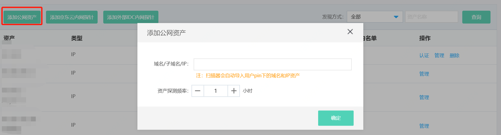
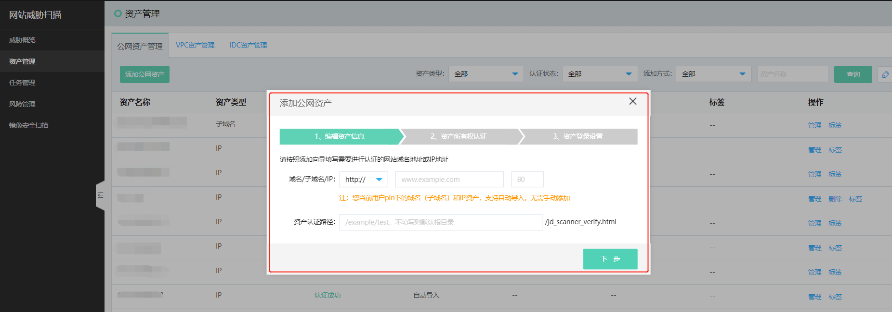
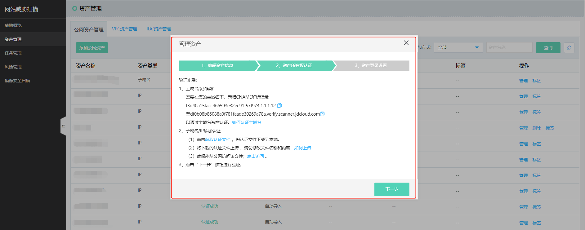
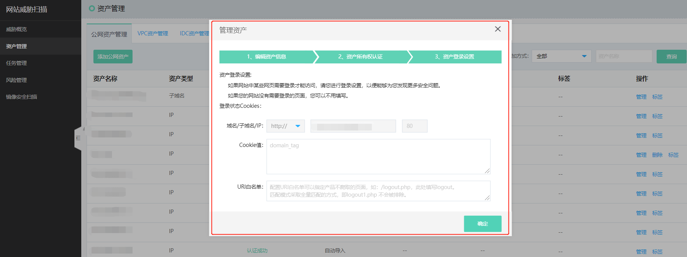

# 资产管理

### 界面

### 添加扫描公网资产

【场景1】：针对您注册在京东智联云域名解析服务的下的域名/子域名相关信息，网站威胁扫描产品自动导入，无需认证。同时支持添加资产的资产cookies（完成添加资产后，点击【管理】添加cookies信息）。

【场景2】：针对注册在您用户PIN账号下的公网IP地址，网站威胁扫描产品自动导入，无需认证。同时支持添加资产的资产cookies（完成添加资产后，点击【管理】添加cookies信息）。

【场景3】：针对未注册在京东智联云域名解析服务的下的域名/子域名相关信息，需要您手工添加（如果是添加项是主域名，通过CNAME方式认证，如果是添加的是子域名，通过文件方式认证），需要认证。同时支持添加资产的资产cookies（完成添加资产后，点击【管理】添加cookies信息）。

### 认证管理

首先，根据认证场景添加相关认证信息，然后手工点击【认证】。

- 域名认证场景

  需要您登录自己的域名解析服务中添加相关生成的cname信息。  

- IP/子域名认证场景

  下载资产认证文件（jd_scanner_verify.html），需要您登录自己的网站添加到网站根目录下，并进行认证。  

 ### 添加cookies登录状态&URI白名单

 点击【管理】进入URI白名单、cookies登录状态管理

 
