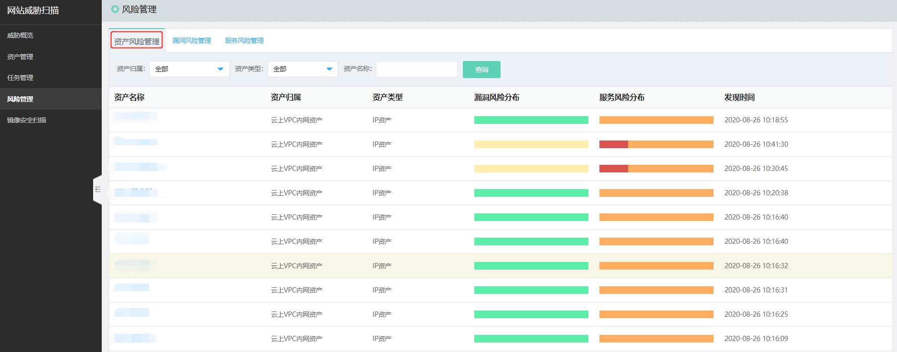
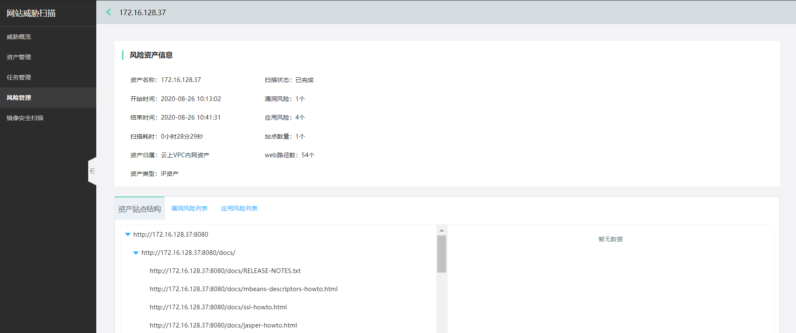
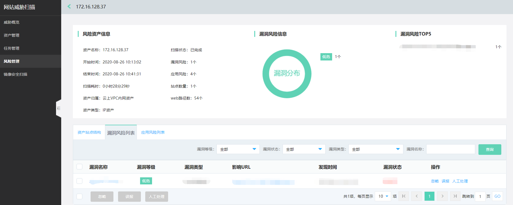
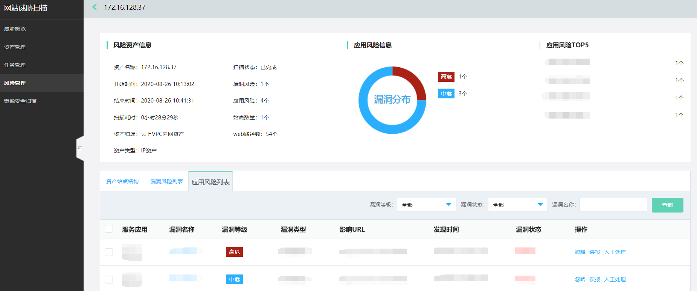
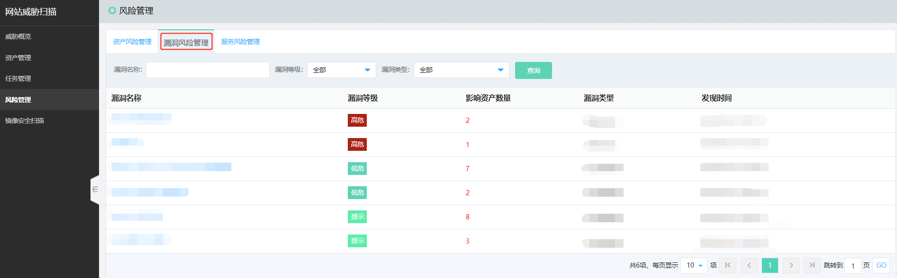
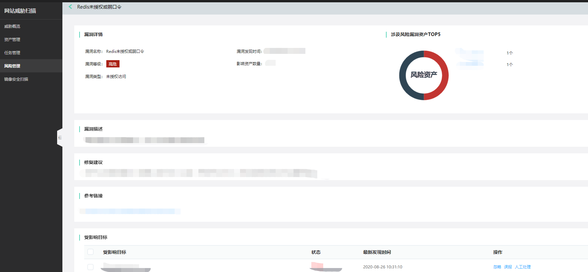
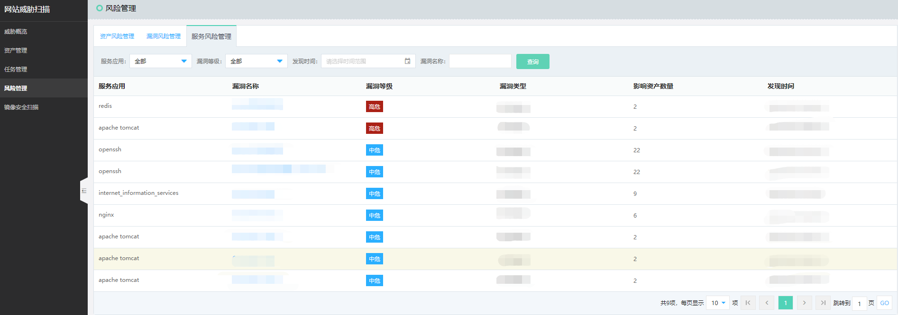
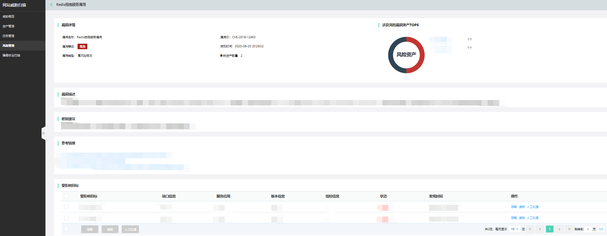

# 风险管理

风险管理从**资产风险管理、漏洞风险管理、服务风险管理**三个维度，显示漏洞扫描结果

### 资产维度

点击【资产名称】，进入资产风险详情页。

- 站点结构

  可以看到风险资产信息详情摘要、站点结构概览

- 漏洞风险列表

  可以看到风险资产的漏洞风险信息

- 服务风险列表

  可以看到风险资产的服务风险信息

### 漏洞维度

点击【漏洞名称】，进入漏洞风险详情页。

### 服务维度

点击【漏洞名称】，进入服务风险详情页。

