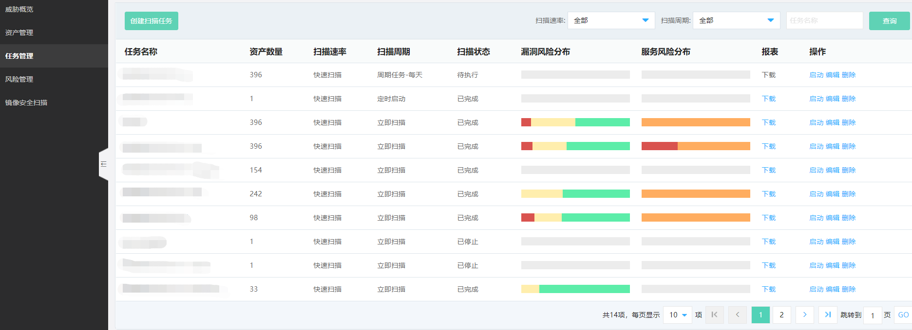
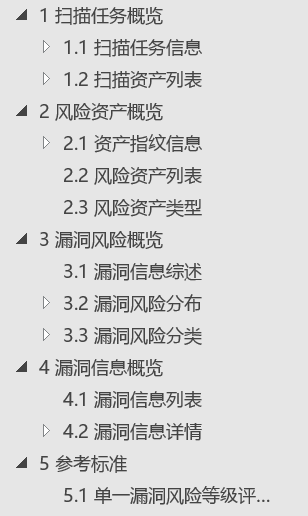

# 任务管理

### 创建任务

  

扫描目标：
- 公网资产：通过资产管理导入，支持单IP，域名、子域名 
- 云上VPC内网资产
- 外部IDC内网资产

扫描模块：端口漏洞扫描，Web漏洞扫描、弱口令扫描、WebService扫描。

执行方式：立刻扫描、定时启动、周期任务  

端口配置：端口扫描策略，您可以根据需要进行灵活设置，默认启动扫描的端口：21-25,80-89,110,143,443,513,873,1080,1433,1521,1158,3306-3308,3389,3690,5900,6379,7001,8000-8090,9000,9418,27017-27019,50060,111,11211,2049  

          由于启动UDP扫描配置，会一定程度上影响扫描速度，请您谨慎开启。  

Web扫描配置：爬虫深度：默认为3（可以配置1-7），设置爬虫深度越深，一定程度上会增加扫描时长，请您谨慎开启。   

           最大爬取总数：默认为50（可以配置1-1000）  

### 任务管理

  

### 报表下载

在任务栏，点击【下载】

  