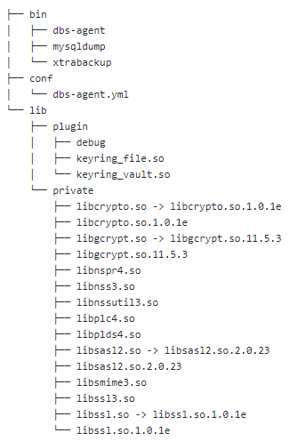

# DBS Agent操作说明

## DBS Agent安装配置

* DBS Agent 由用户自行下载安装到服务器上并启动运行，一台服务器上运行一个Agent，通过配置策略备份这台服务器上的所有MySQL实例
* DBS Agent 可以以 StandaloneMode 的方式独立运行，不必依赖 Manager，此时的备份策略由配置文件指定
* DBS Agent 备份生成的文件可通过配置文件指定存放到OSS或本地目录(可为挂载到本地的网络地址)

### DBS Agent下载地址

https://jddb-common-public.s3.cn-north-1.jdcloud-oss.com/dbsv2/dbs-agent.zip

#### 安装前准备工作

* 修改mysql配置文件
```
  vi /etc/my.cnf

  添加以下配置

  #开启binlog

  server_id=2

  log-bin=/var/lib/mysql/mysql-bin

  binlog_format = ROW
  
  ```


#### 安装步骤

* DBS Agent目录放置/opt目录下

创建软连接：

```
chmod -R 755 /opt/dbs/lib/private/*

cd /opt/dbs/lib/private

ln -s libcrypto.so.1.0.1e libcrypto.so

ln -s libgcrypt.so.11.5.3 libgcrypt.so

ln -s libsasl2.so.2.0.23 libsasl2.so

ln -s libssl.so.1.0.1e libssl.so

cd /opt/dbs/bin

chmod 755 dbs-agent

chmod 755 mysqldump

chmod 755 xtrabackup

```

#### 安装后的目录结构
* 目录结构



#### dbs-agent.yml 配置说明

```
UseHttps: false
Region: "cn-north-1" // agent 所在的 region
ManagerAddr: "10.226.148.63:8000" // agent 所在的 region 的网关地址
AccessKey: "DD1B0BFA7BAA5DAED057ACF4817AF55B" // 访问网关的 ak
SecretKey: "6FC47989E4F4B1F489004F12FFFD89DE" // 访问网关的 sk
InstallPath: "/opt/dbs" // agent 的安装目录，建议用该默认值
RuntimePath: "/tmp/dbs" // agent 的运行目录，建议用该默认值
Storage:
  Type: "S3"
  S3:
    Endpoint: "s3-internal.cn-east-1.jdcloud-oss.com" // 对象存储的地址
    Region: "cn-east-1" // 对象存储的region 
    Bucket: "dbs-bucket" // 对象存储的 bucket
    AccessKey: "4C93C07FF84687DFCE494434CEF032AA" // 对象存储的 ak
    SecretKey: "39F845FD940AFB330AC3DF2717380C56" // 对象存储的 sk
  
```

##### 修改备份策略查看备份结果

* 修改 /opt/dbs/conf/dbs-agent.yml 中 BackupPlan StartTime及对应备份配置，发现到指定时间备份成功发起。

* 当 BackupType: "Logical" 时，修改 Databases 和 Tables，备份后的sql中对应库、表和指定的一样。

* 注： Databases 和 Tables 均为列表，当指定多个库时不能指定表，当指定多个表时只能指定一个库，如果需要指定多个库的多个表，需要通过设置多个备份策略实现。

* 添加多个MySQL 实例的多个备份策略，发现它们到各自指定的时间后都会执行。

* BackupType: "Logical" 和 BackupType: "Physical" 均可备份成功。

##### 修改目标存储
* 修改 /opt/dbs/conf/dbs-agent.yml 的 Storage.Type 改为 LocalDir，可看到备份生成的文件存储在 Dir 指定的目录中，所有者为 Owner 指定的用户。

* 修改 /opt/dbs/conf/dbs-agent.yml 的 Storage.Type 改为 S3，可看到文件备份到指定的OSS上。

##### 配置文件路径覆盖

* 配置文件读取路径有优先级：$HOME/.dbs/dbs-agent.yml 覆盖 /etc/dbs/dbs-agent.yml 覆盖 /opt/dbs/dbs-agent.yml。

## DBS Agent启停

* 修改 /opt/dbs/conf/dbs-agent.yml 配置正确的MySQL 账户、备份策略及目标存储。

* 服务启动：运行 cd /opt/dbs/bin/ && ./dbs-agent 启动服务，运行 ps aux | grep 'dbs-agent' 可看到服务正常启动。

* 再次运行 ./dbs-agent 提示资源占用，即无法在同一台服务器上启动多个 agent。

* 服务停止：./dbs-agent -s stop，运行 ps aux | grep 'dbs-agent' 可看到服务已停止。
