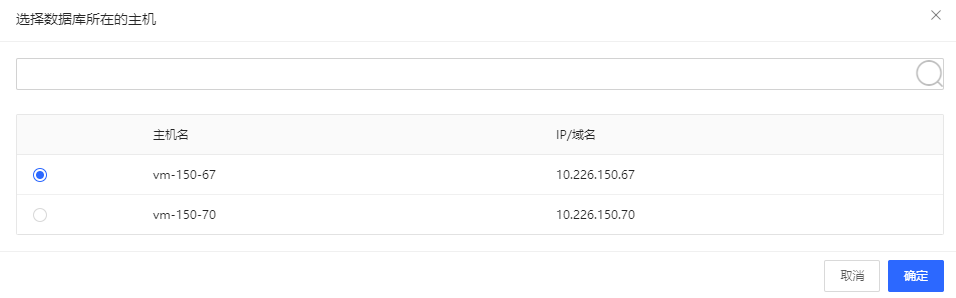
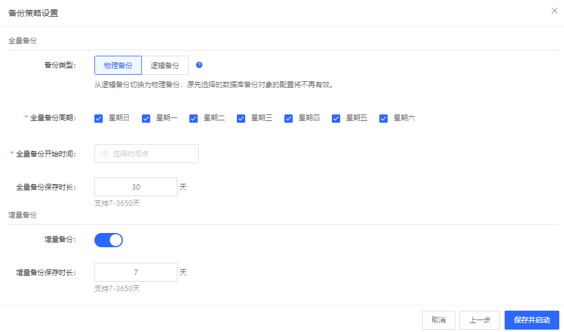

# 初始化备份计划

通过点击备份计划对应初始化
 

进入数据源配置如下图（已有端口及端口）：
 

进入数据源配置如下图（新建端口及端口）：

 
配置方式：可以默认选择已有端口及账号，也可以选择新建端口及账号。

实例所在主机：

 
端口：选择实例对应端口（配置方式：已有端口及账号）或者配置实例对应端口（配置方式：新建端口及账号）。
数据库账号：选择备份数据库使用数据库账号（配置方式：已有端口及账号），或者配置备份数据库使用数据库账号（配置方式：新建端口及账号）。
密码：不需要配置密码（配置方式：已有端口及账号），或者配置密码（配置方式：新建端口及账号）。
my.cnf的路径：不需要配置my.cnf的路径（配置方式：已有端口及账号），或者配置my.cnf的路径（配置方式：新建端口及账号）。

点击下一步进入备份策略设置页面，

  

备份类型可选物理备份或逻辑备份，同时支持全量备份和增量备份，
全量备份默认全部选中每天备份一次，用户可以自行勾选修改。
增量备份默认打开，用户配置保留时长后，如果备份类型为物理备份直接保存并启动。
如果备份类型为逻辑备份，点击下一步进入到备份对象的配置。
  
 
