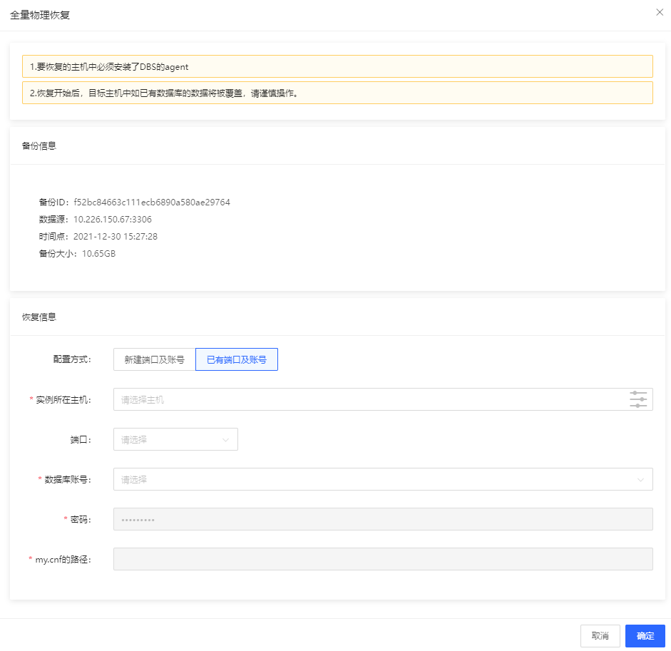
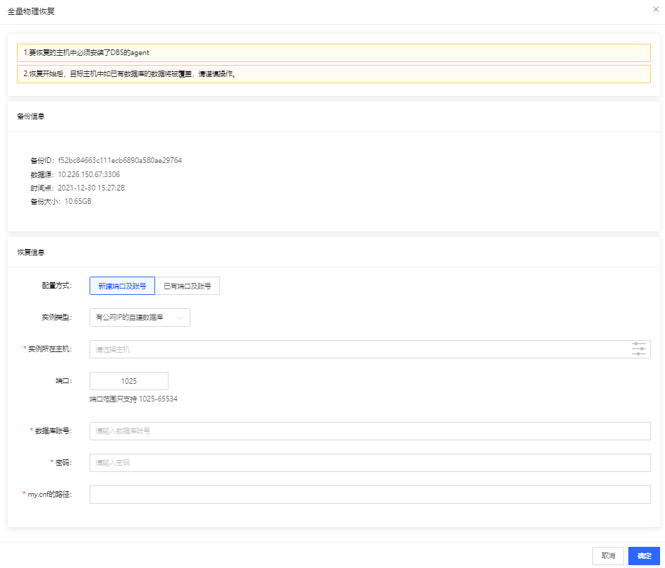
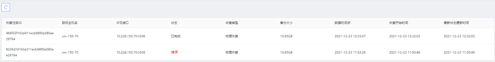

# 物理备份恢复

根据物理备份进行全量恢复，只有“完成”状态的备份可以恢复。
操作入口在备份任务→物理备份的操作列里。
点击恢复后，跳出以下弹窗，可以将备份恢复到指定的主机。 该主机必须先安装了agent

提示信息：
1.	要恢复的主机中必须安装了DBS的agent
2.	恢复开始后，目标主机中如已有数据库的数据将被覆盖，请谨慎操作。

用户可以选择是使用已有端口和账号或者用户选择新建端口或账号。

 

物理恢复列表如下：
 
 
