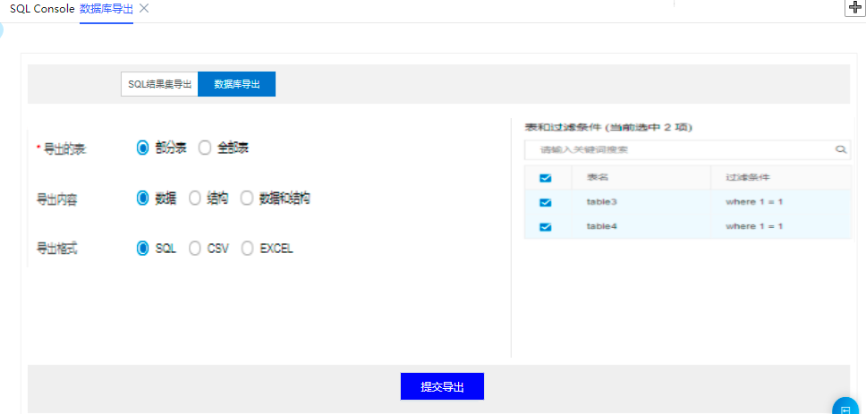

# 数据库导出
点击顶部【数据库导出】菜单，弹出数据库导出工作区，包含SQL结果集导出和数据库导出两种导出方式，通过【SQL结果集导出】和【数据库导出】按钮进行切换。

## SQL结果集导出
选择导出模式，填写影响行数，根据实际情况选择是否跳过校验，输入导出SQL语句。
多条SQL语句用英文分号隔开。如下图：

 
## 数据库导出
数据库导出可以选择部分表或者全部表，部分表时可以进行选择具体表名以及过滤条件进行导出数据，过滤条件默认的全部记录数据。

导出内容可以为数据，结构，数据和结构，选择导出格式，点击【提交导出】即可。
 

