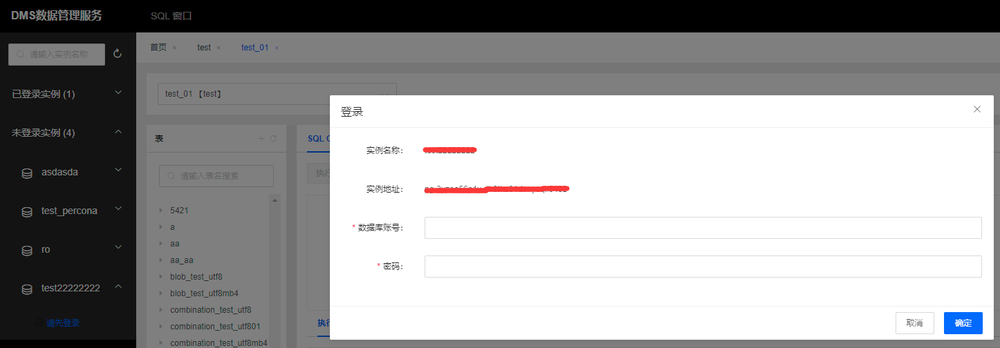
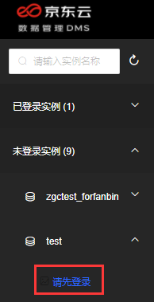

# 登录数据库 

通过点击RDS对应实例登录数据库按钮，首先打开的是数据管理DMS老版本，可以通过点击右上角菜单【体验新版控制台】，打开新版DMS控制台页面，并显示当前实例登录框，用户输入数据库账号和密码进行登录，新版数据管理服务DMS登录页面如下：

实例名称和实例地址会自动带出，用户输入数据库账号，密码点击确定后进行权限的安全访问控制。

左侧菜单按照已登录实例，未登录实例进行区分展示，可以下拉未登录实例实例列表，选择目标操作实例进行登录，如下图所示：

