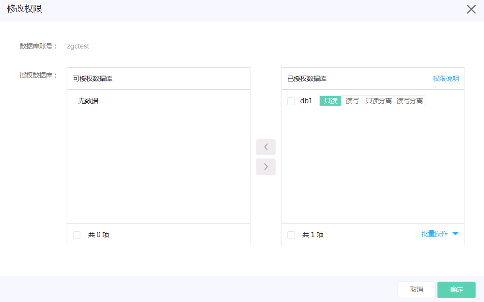

# 设置权限

## 权限说明
DRDS新增了两个账号权限，用于设置读写分离相关的操作，具体的账号权限说明如下：
- rw：具有该数据库主节点的读写权限，所有SQL发往RDS MySQL主节点。
- ro：具有该数据库主节点的读权限，所有SQL发往RDS MySQL主节点。
- rws：具有该数据库主节点的读写权限和只读节点的读权限，根据【自动读写分离规则】(可参见DRDS读写分离概述中相关部分）将部分SQL转发到RDS MySQL只读节点，其余SQL的仍发往RDS MySQL主节点。
- ros：具有该数据库只读节点上的的读权限，所有SQL转发到RDS MySQL只读节点，如果某个RDS MySQL无只读节点，则SQL执行时报错。
其中rws和ros跟读写分离有关。 如果用户需要使用读写分离功能，需要给相应的数据库账号授予rws或者ros 权限。

## 操作
**1. 进入【账号管理】页面**

点击实例名，进入实例页面，选择 **【账号管理】** 页面，点击“**修改权限”**

**2. 设置权限**

设置账号的权限信息

