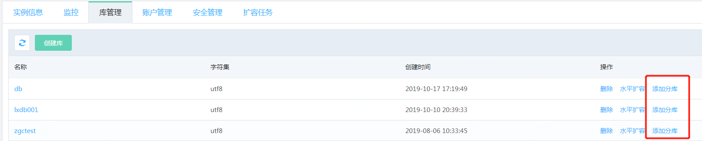
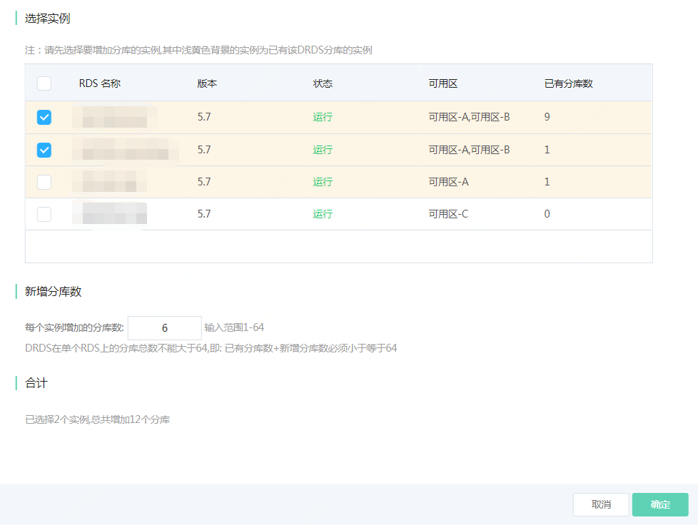

# 添加分库
DRDS 支持 按数值、字符串以及日期时间进行拆分。 

对于按日期时间进行拆分的表，每个分表只存储一个时间段的数据，不会循环使用。当分表用尽后，用户需要手动对分表进行扩展。扩展分表有两个步骤：
1. 通过控制台添加分库
2. 连接到DRDS 数据库中，执行SQL，扩展相应的表

例如，用户的某个DRDS数据库有24个分库，其中表tab1按年月拆分，每个月一个分表，因此总共可以存储24个月的数据。如果用户需要存储更多时间段的数据，需要手动增加分库数目，并对表进行扩展。 因此本文档描述如何在控制台上，添加新的分库，并通过SQL 扩展分表。

## 在控制台上添加分库

**1. 进入【库管理】页面**

点击实例名，进入实例页面，选择 **【库管理】** 页面，点击 **【添加分库】**



**2. 选择要添加分库的RDS MySQL实例**
在实例列表中选择要添加分库的RDS MySQL实例，该列表中仅会列出与当前 DRDS 在同一个VPC中且RDS MySQL版本与当前DRDS后端RDS MySQL版本一致的实例。选择完成后输入在每个实例上要添加分库的数目。 例如输入8，表示在所选择的每个RDS MySQL实例中，都会添加8个分库。

选择完成后，点击确认，DRDS 会选择的实例中创建相应数目的分库 

**注意：单个DRDS数据库在1个RDS MySQL上的分库总数不能大于64,即: 已有分库数+新增分库数必须小于等于64**

例如，DRDS 数据库drds_db1 在实例 drds_mysql_1 上已有8个分库，那边drds_db1在 drds_mysql_1 上最多还能添加56个分库



**3. 执行SQL命令，扩展分表**
添加分库完成后，可以连接到DRDS 数据库中，执行SQL 扩展相应的分表

例如对于表timetb,在所有的新增分库上扩展分表，SQL为
```SQL
alter table timetb add partitions on all dbpartitions;
```

具体的SQL语法及说明可参考文档[DRDS DDL SQL 语法](../../SQL-Doc/DRDS-DDL.md) （“扩展拆分表”部分）
