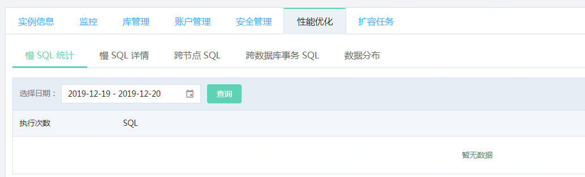
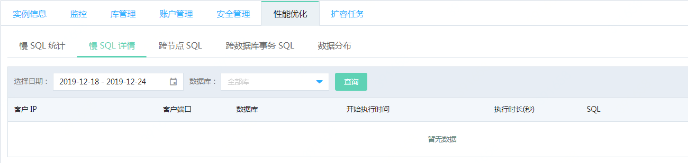
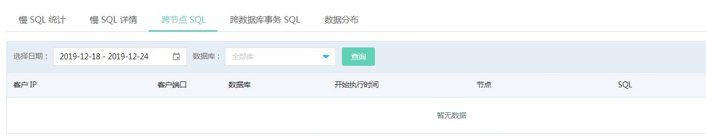
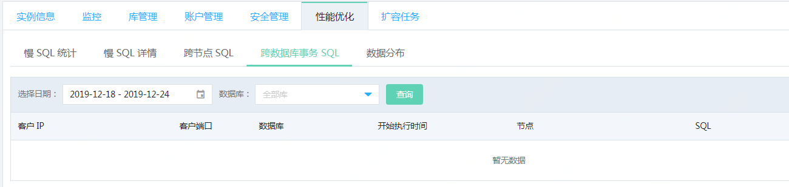
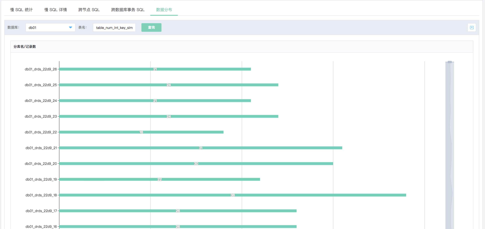

# 功能介绍
可以从多种角度统计SQL的执行情况，帮助用户发现问题SQL和潜在性能瓶颈，以便有针对性的进行优化。  
目前京东云 DRDS 可提供以下几种类型SQL执行情况及数据统计。
- 慢SQL 统计
- 慢SQL详情
- 跨节点SQL
- 跨数据库事务SQL
- 数据分布

可查询7天内的数据，所有的查询结果均可下载为csv文件。 出于性能考虑，文件下载目前最大支持前100条记录。

#### 慢SQL的定义
慢SQL是指执行时间>=1秒的SQL，即DRDS收到客户端SQL到返回结果给客户端的时间，包含了DRDS的处理时间和RDS MySQL的执行时间。

## 一. 慢SQL统计
统计指定时间段中出现的各个慢SQL的次数，帮助提炼发生频率最高，最值得关注的TOP SQL。

## 二. 慢SQL详情
提供了慢SQL执行的详情情况，包括客户的IP，SQL开始执行的时间，执行时长等信息。您可根据这些信息，针对性的对SQL进行优化。

## 三. 跨节点SQL
这是一个潜在的SQL优化点。 从理论上述说，客户端发出的SQL在后端单个节点上执行时，效率最高。如果某个SQL执行时，需要访问后端的多个RDS节点时，DRDS需要对数据进行合并，排序等，性能会有一定幅度的下降。因此该功能可帮助查找哪些SQL在实际执行时，访问了多个RDS MySQL节点。

## 四. 跨数据库事务SQL
同理，客户端发出的一个SQL在后端可能被拆分为多个SQL并转发到不同的RDS MySQL节点上去执行，如果这些SQL是在同一个事务中，容易引起一些潜在的问题，例如死锁的扩散等。

## 五. 数据分布
由于同一个表的数据被拆分后放到后端不同的RDS MySQL的数据库中，不同的数据库中的数据库个不相同。该功能能直观的展示某个表在不同的数据库中数据量的分布情况，可有效的发现数据倾斜及严重程度。
 
 
