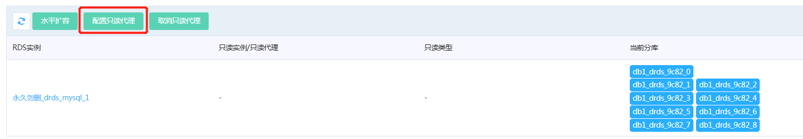
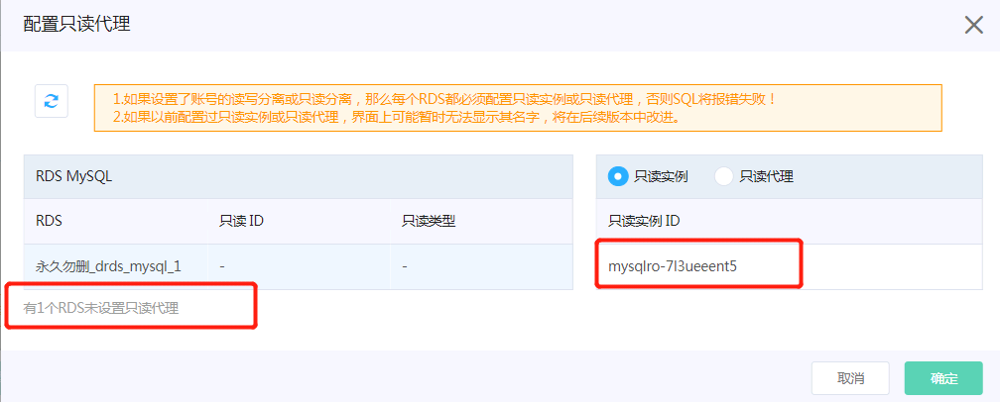

# DRDS 读写分离设置

**前提条件**
在DRDS 读写分离设置前，需要先配置好该DRDS后端 RDS MySQL的只读实例和只读代理，具体方式可参考[只读实例帮助文档](https://docs.jdcloud.com/cn/rds/create-readonly-instance) 以及[只读代理帮助文档](https://docs.jdcloud.com/cn/rds/create-readonlygroup)

## 1. 配置数据库的读写分离
1) 进入DRDS实例的【库信息】页面中，点击数据库名，进入数据库设置页面。 
2) 点击【配置只读代理】，对当前数据库进行只读实例或只读代理的设置。

3) 弹出的窗口中，左边列表是该数据库后端的RDS MySQL，右边列表是选中RDS MySQL相关的只读实例或只读代理。  
对于左边列表中每个RDS MySQL，在右边列表中点击只读实例或只读代理，将选择只读实例/代理关联到RDS MySQL上。  
**建议优先选择只读代理，以获得只读操作的高可用性。**  

4) 注意：需要对每个RDS MySQL设置只读代理/实例，否则应用会由于访问不到RDS MySQL的只读实例/代理而报错。 可通过窗口左下角的提示信息，检查是否所有的RDS MySQL都配置完成了

## 2. 设置账号的读写分离权限
DRDS新增了两个账号权限，用于设置读写分离相关的操作，目前账号权限说明如下：
- rw：具有该数据库主节点的读写权限，所有SQL发往RDS MySQL主节点。
- ro：具有该数据库主节点的读权限，所有SQL发往RDS MySQL主节点。
- rws：具有该数据库主节点的读写权限和只读节点的读权限，根据【自动读写分离规则】(可参见DRDS读写分离概述中相关部分）将部分SQL转发到RDS MySQL只读节点，其余SQL的仍发往RDS MySQL主节点。
- ros：具有该数据库只读节点上的的读权限，所有SQL转发到RDS MySQL只读节点，如果某个RDS MySQL无只读节点，则SQL执行时报错。

其中rws和ros跟读写分离有关。 如果用户需要使用读写分离功能，需要给相应的数据库账号授予rws或者ros 权限。 

## 3. 取消读写分离设置
在 DRDS数据库设置页面，点击【取消只读代理】,然后在弹出的窗口中确认即可。
