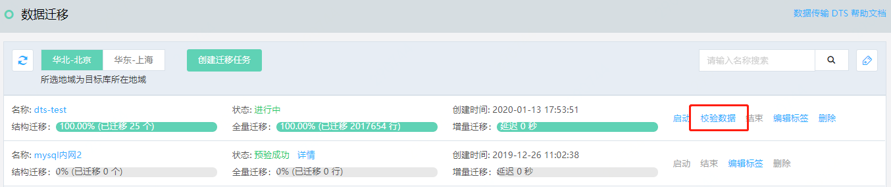

# 执行数据校验

## 说明

- MySQL/Percona/MariaDB  支持全量校验，如创建任务时选校验数据，则在全量数据迁移完成后可手动执行数据校验。

- SQL Server支持全量校验，如创建任务时选校验数据，则在迁移任务结束后自动执行数据校验，不需要手动触发。

- MongoDB暂不支持数据校验。

## 操作步骤

以下为MySQL/Percona/MariaDB执行数据校验的操作步骤。

1. 进入数据迁移任务列表。

2. 选择迁移任务，点击**校验数据**，等待数据校验完成。

   

3. 可在任务详情中查看数据校验结果。

   
