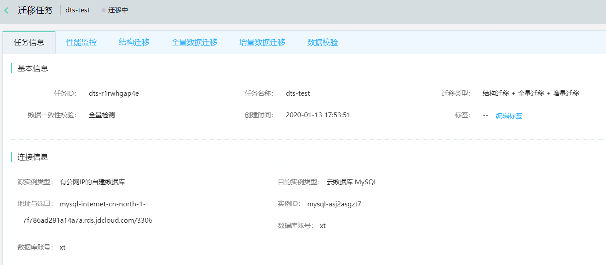
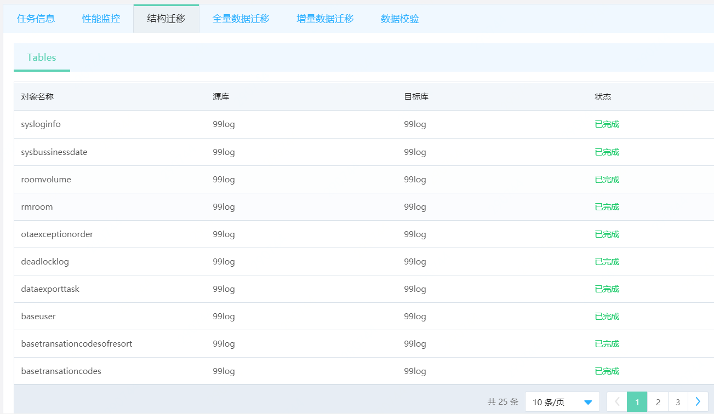
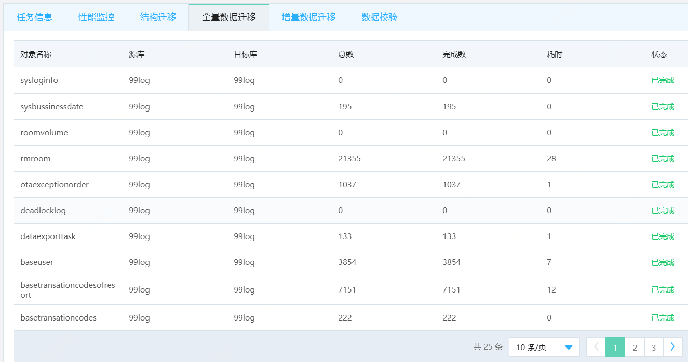
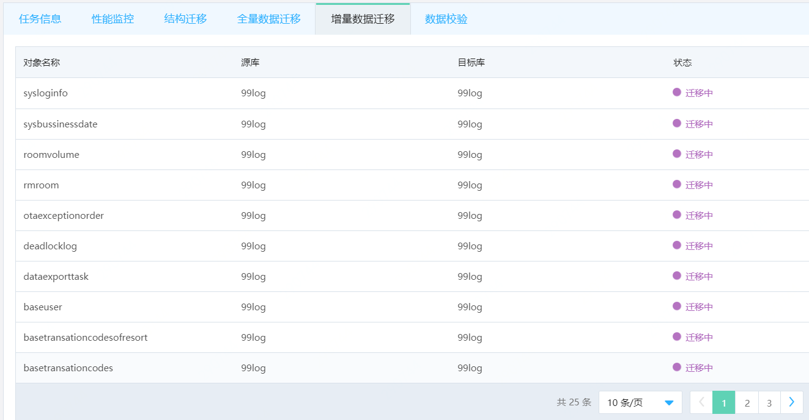
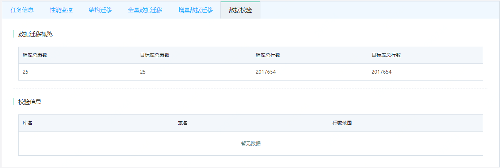
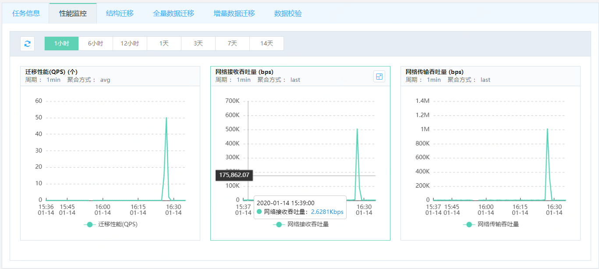

# 查看迁移任务详情

在迁移任务详情页可查看迁移任务的基本信息及各个迁移阶段的迁移信息。  

## 操作步骤

1. 进入数据迁移任务列表。  

2. 选择要查看的迁移任务，点击任务名称，进入任务详情页。  

   - 任务信息：迁移任务的基本信息，包括任务ID、迁移类型、源库和目标库信息。

   

   - 结构迁移：查看结构迁移的详情。

   
   
   - 全量数据迁移：全量数据迁移详情。
   
   
   
   - 增量数据迁移：增量数据迁移详情。

   
   
   - 数据校验：查看数据一致性校验情况，包含总迁移数据库概览、不一致数据信息。

   
   
   -  性能监控：迁移性能监控信息。

   

