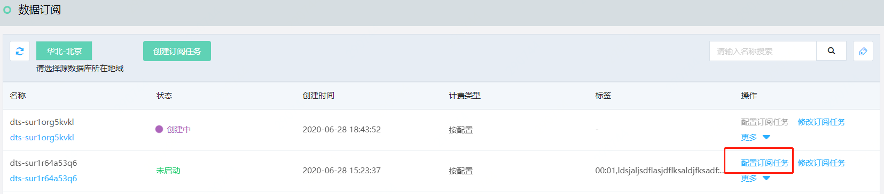
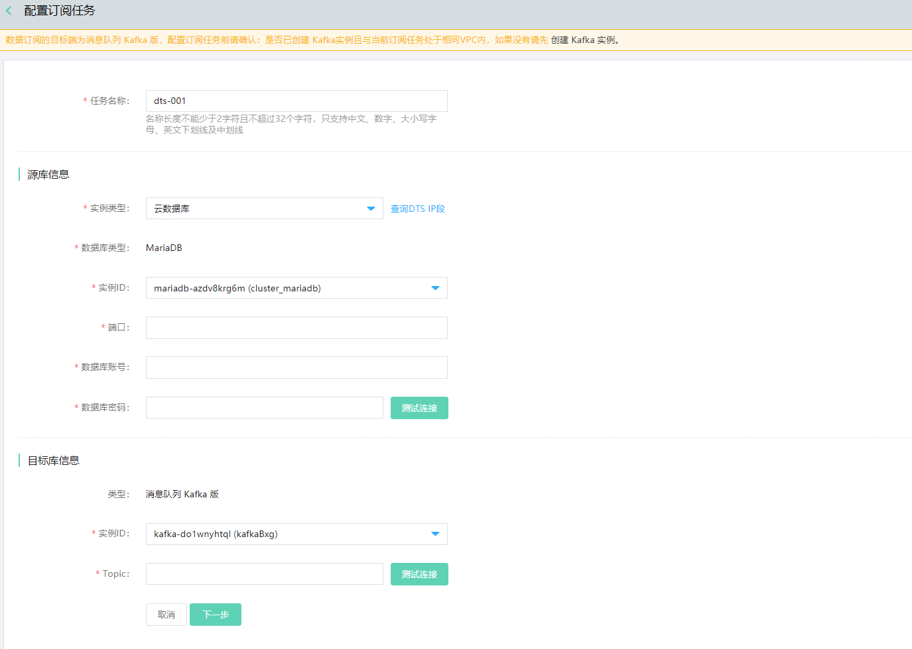

# 配置订阅任务

订阅任务创建完成后，需配置订阅任务的源库与目标端相关信息，以下说明如何配置。

## 准备工作

- 创建作为订阅目标的Kafka实例，如当前尚未创建，请先[创建Kafka实例](http://kafka-console.jdcloud.com/list)。
- 源数据库已创建有相应权限的账号。

## 操作步骤

1. 登录 [DTS 控制台](http://dts-console.jdcloud.com/subscription/list)，在左侧菜单点击**数据订阅**。

2. 在数据订阅列表页，选择目标任务，点击**配置订阅任务**，进入创建订阅任务配置页面。

   

3. 在配置订阅任务页，填写相关信息。

   

   - 任务名称
   - 源库信息
     - 实例类型：支持云数据库、有公网IP的自建数据库、通过专线/内网连接的自建数据库。
     - 数据库类型：订阅任务的数据库类型，创建订阅任务时的选择，不可修改。
     - 实例ID：实例类型为“云数据库”时，请选择作为订阅源的数据库实例ID。
     - 数据库地址与端口：实例类型为“有公网IP的自建数据库”、“通过专线/内网连接的自建数据库”时，请填写数据库地址和端口。
     - 数据库账号与密码。
   - 目标端信息
     - 目前至支持消息队列Kafka版，请选择实例ID。
     - Topic：Kafka实例上的Topic，如未创建，请填写Topic名称，DTS服务将在Kafka实例上创建。

4. 填写完成后，点击**下一步**，进入下一页，选择订阅数据类型和订阅对象。

5. 确认勾选“授权DTS服务管理源库与目标端”，点击**保存并启动**。

6. 等待预检查完成，订阅任务状态变更为“运行”，订阅任务执行成功。

   

   

