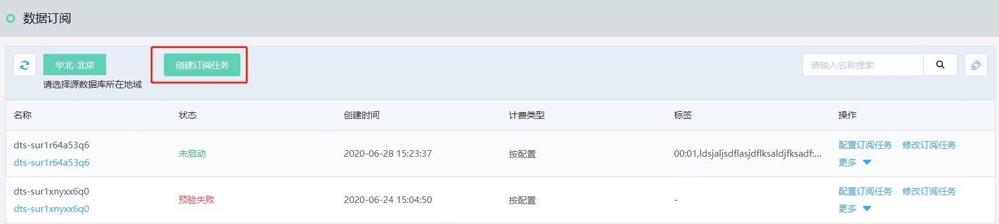
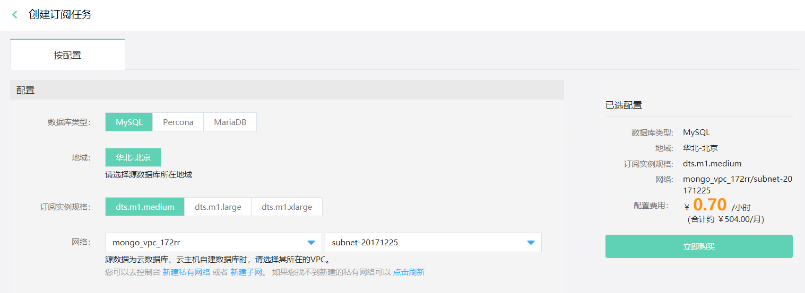

# 创建订阅任务

在DTS 控制台，只需几步简单操作，即可创建数据订阅任务。

## 准备工作

- 创建作为订阅目标的Kafka实例，如当前尚未创建，请先[创建Kafka实例](http://kafka-console.jdcloud.com/list)。
- 源数据库已创建有相应权限的账号。

## 操作步骤

1. 登录 [DTS 控制台](http://dts-console.jdcloud.com/subscription/list)，在左侧菜单点击**数据订阅**。

2. 在数据订阅列表页，点击**创建订阅任务**，进入创建订阅任务页面。

   

3. 在创建订阅任务页，选择任务相关配置。

   在选择网络信息时，请注意源数据为云数据库、云主机自建数据库时，请选择其所在的VPC。

   

4. 配置信息选择完成，确认无误后，点击**立即购买**，等待订阅任务创建完成。

   

   

