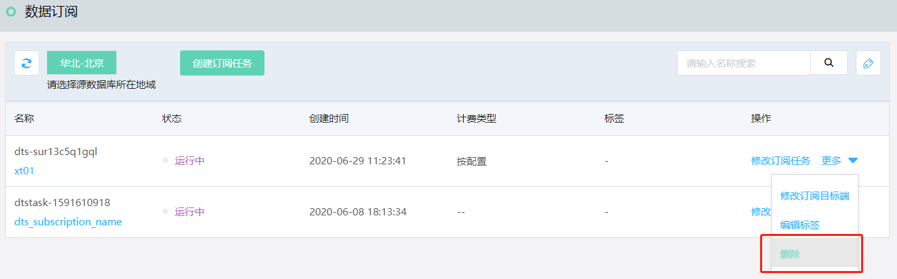
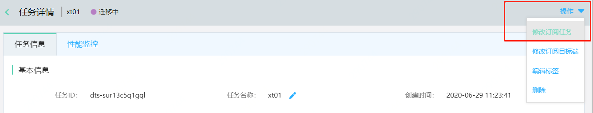

# 修改订阅任务

如不再需要订阅任务，可随时在控制台删除任务。

## 操作步骤

1. 登录 [DTS 控制台](http://dts-console.jdcloud.com/subscription/list)，在左侧菜单点击**数据订阅**。

2. 在数据订阅列表页，选择目标任务，在操作项中点击**删除**。

   

   或者进入任务详情页，点击**操作-删除**。

   

3. 在“修改订阅任务”页面填写相应信息，请参考“[配置订阅任务](Config-Subscription-Task.md)”。

4. 订阅任务删除后不可恢复，请慎重处理。
