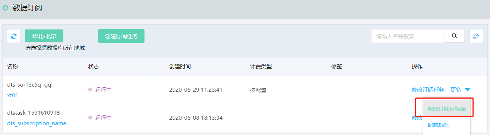
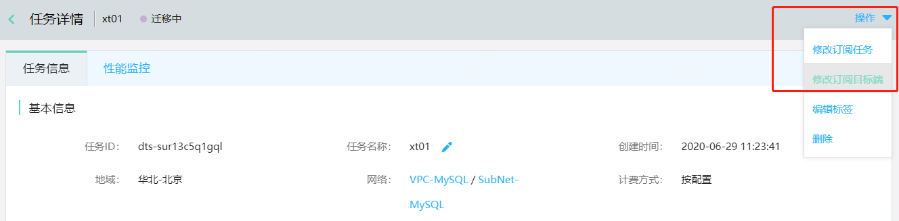
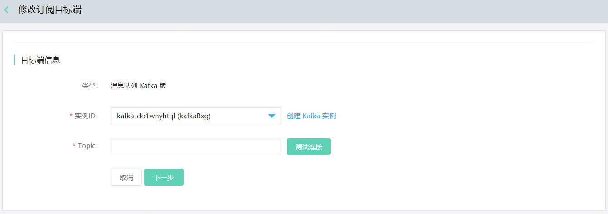

# 修改订阅目标端

订阅任务正常运行时，如需要修改订阅目标端，可在控制台修改。

## 注意事项

- 修改订阅任务后，数据订阅服务将重新从源数据库获取数据或结构更新，原有数据与进度将不做保存。

## 操作步骤

1. 登录 [DTS 控制台](http://dts-console.jdcloud.com/subscription/list)，在左侧菜单点击**数据订阅**。

2. 在数据订阅列表页，选择目标任务，在操作项中点击**修改订阅目标端**。

   

   或者进入任务详情，在右上角点击**操作-修改订阅目标端**。

   

3. 在"修改目标端"页面，重新选择Kafka实例或Topic。

   

4. 修改完成后，等待任务完成预检查并正常运行。
