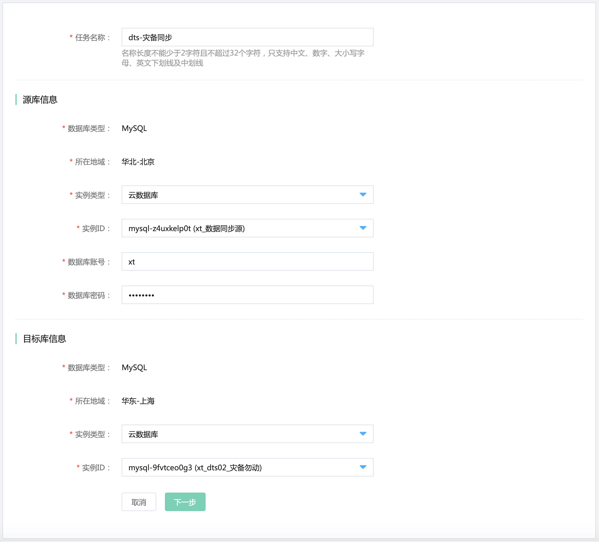
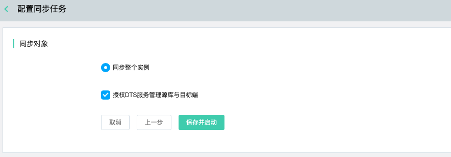

# 配置灾备同步任务

灾备同步任务创建完成后，需配置同步任务的源库与目标端灾备实例，以下说明如何配置。

## 操作步骤

1. 登录 [DTS控制台](http://dts-console.jdcloud.com/subscription/list)，在左侧菜单中点击**数据同步**。

2. 在数据同步列表页，选择目标任务，点击**配置同步任务**，打开同步任务配置页。

   

3. 在创建同步任务页，填写相关配置。

   

   - 任务名称

   - 源库信息

     - 实例类型：仅支持云数据库。
     - 实例ID：选择云数据库MySQL实例ID。
     - 数据库账号
     - 数据库密码
     
- 目标库
   
  - 实例类型：当前仅支持云数据库。
     - 实例ID：选择MySQL灾备实例ID。
     
   - 填写无误后，点击“下一步”，保存配置信息并启动。
   
     

4. 在任务列表页可查看当前任务信息。

   

