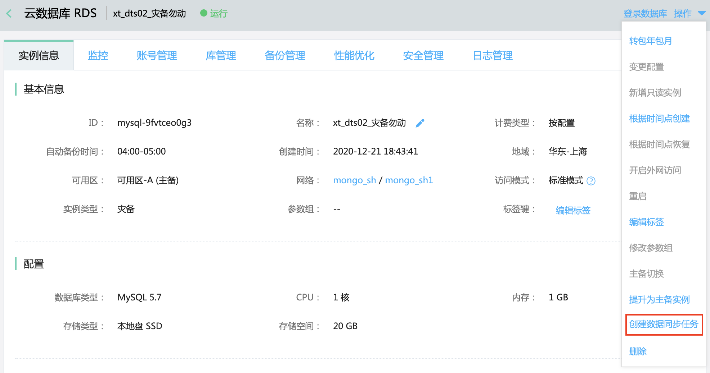
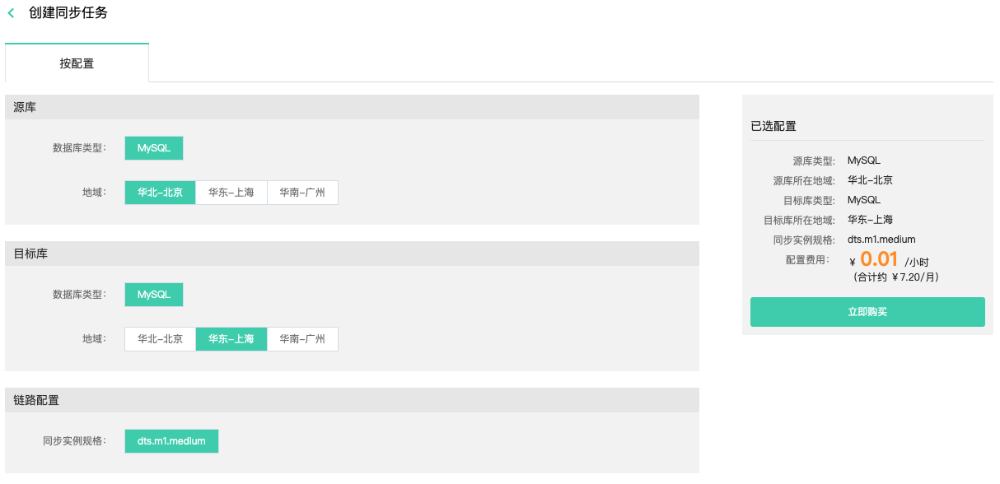
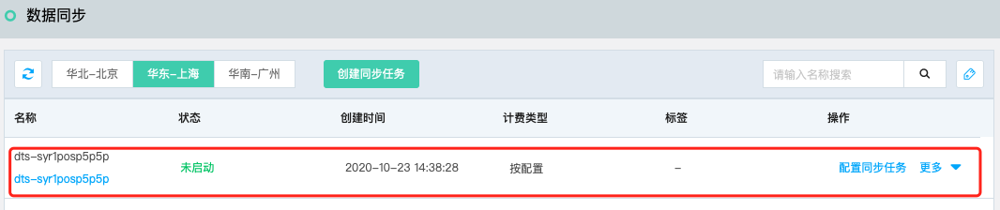

# 创建灾备同步任务

通过灾备同步服务，可以简单方便的实现云数据MySQL跨地域灾备，以满足数据异地灾备的需求。

## 准备工作

- 创建作为灾备数据库的云数据库MySQL灾备实例。

## 操作步骤

1. 登录 [RDS控制台](https://rds-console.jdcloud.com/rds/database)，在左侧菜单中点击**实例列表**，选择已创建的MySQL灾备实例，如果当前还没有MySQL灾备实例，请先创建。

2. 进入MySQL灾备实例详情页，点击右上角**操作**，选择**创建同步任务**。

   

3. 在创建同步任务页，选择相关配置。

   

   - 源库：选择源数据的类型与所在地域。
   - 目标库：选择目标库的类型与所在地域。
   - 确认无误后，点击“立即购买”，完成支持流程，等待任务创建完成。

4. 在DTS数据同步任务列表页可查看创建的任务。

   
