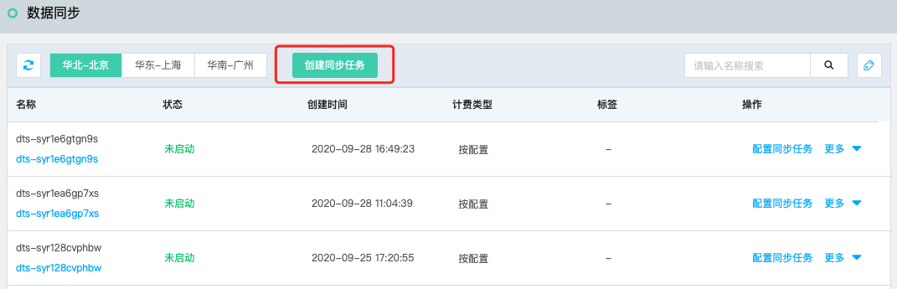

# 创建同步任务

在DTS控制台，只需要简单几步操作，即可创建灾备同步任务。

## 准备工作

- 已创建作为源库的云数据库 MySQL 主备实例。
- 已创建作为灾备的云数据库 MySQL 灾备实例。

## 操作步骤

1. 登录 [DTS控制台](http://dts-console.jdcloud.com/subscription/list)，在左侧菜单中点击**数据同步**。

2. 在数据同步列表页，点击**创建同步任务**，打开同步任务创建页。

   

3. 在创建同步任务页，选择相关配置。

   

   - 源库：选择源数据的类型与所在地域。
   - 目标库：选择目标库的类型与所在地域。
   - 确认无误后，点击“立即购买”，完成支持流程，等待任务创建完成。

4. 在任务列表页可查看创建的任务。

   
