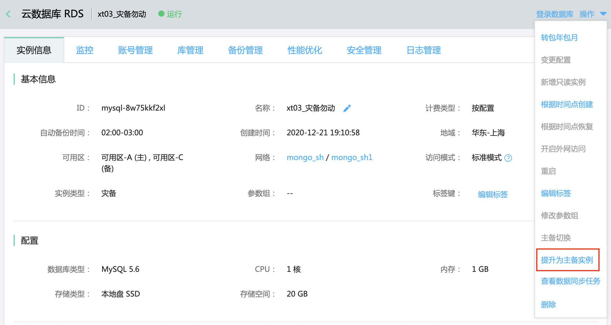

# 结束灾备同步任务

同步任务运行时，可根据需要停止同步任务。

结束灾备任务有两种方式：

- 在DTS控制台找到同步任务，点击**结束同步任务**。任务结束后，MySQL灾备实例将提升为主备实例，可以正常连接使用。
- 在RDS控制台找到灾备实例，进入实例详情页，在右上角点击**提升为主备实例**，灾备实例会被提升为主备实例。

## 操作步骤

- 登录 [DTS控制台](http://dts-console.jdcloud.com/subscription/list)，在左侧菜单中点击**数据同步**。

  在数据同步列表页，选择目标任务，点击**结束同步任务**，同步任务结束后，目的端灾备实例将自动提升为主备实例。

  

- 登录 [RDS控制台](https://rds-console.jdcloud.com/rds/database)，选择灾备实例，进入实例详情页，在右上角点击**操作**-**提升为主备实例**。

  

